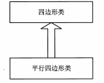

# 接口、继承与多态
> 学习好继承和多态是面向对象开发程序中非常重要的一个环节
> 如果在程序中使用继承和多态得当，整个程序的结构显得有弹性
> 同时可以减少代码的冗余
## 类的继承
- 基本思想是：基于某个父类的拓展，制定出一个新的子类
    - 子类具有父类原有的属性和方法，也可以增加父类所不具备的属性和方法
    - 例子：
    ```java
    public class class10{
        public static void main(String[] args){
        }
    }
    
    public class Test{
    
        public Test(){
            System.out.println("构造的类Test!");
        }
        protected void doSomething(){
            System.out.println("doSomething!");
        }
        protected Test dolt(){
            System.out.println("dolt!");
            return new Test(); 
        } 
    }
    
    public class Test2 extends Test{  //继承父类
    
        public Test2(){               //构造函数
            super();                  //调用父类构造方法
            super.doSomething();      //调用父类成员方法
        }
        protected void doSomethingnew(){ //新增方法
            System.out.println("doSomethingnew!");
        }
        protected void doSomething(){    //重写父类方法
            System.out.println(" 重写 doSomething!");
        }
        protected Test2 dolt(){         //重写父类方法，方法的返回值为Test2类型
            System.out.println("dolt!");
            return new Test2(); 
        } 
    }
    ```


- 关于类的继承：

  - `Test`为`Test2`的父类（超类，基类）
  - `Test2`为`Test`的子类（派生类）
  - 使用`super()`可以实现父类的方法的调用
  - 子类只能调用父类的`public`方法和`protected`方法
  - 子类兵不是只能拓展父类的功能，还能重写父类的成员方法
    - 重写是指，名称保留，重写成员方法的实现内容，更改成员方法的存储权限或者修改成员方法的返回值类型
    - 还有一类特殊的重写，返回值，函数名称，参数类型个和个数相同，只有实现方法不同
    - 当子类重写父类的方法时，不能降低方法的修饰符权限范围

- Java一切都以对象的形式进行处理，在创建一个子类对象，将包含一个父类对象，当实例化子类对象时，父类对象也相应的被实例化。

  - 例子：

    ```java
    class Parent{
        public Parent(){
            System.out.println("构造父类对象Parent!");
        }
    }
    
    class SubParent extends Parent{
        public SubParent(){
            System.out.println("构造子类对象SubParent!");
        }
    }
    
    public class class110{
        public static void main(String[] args){
    
            SubParent sc = new SubParent(); 
    
        }
    }
    /*
    构造父类对象Parent!
    构造子类对象SubParent!
    前面类的前面不需要写权限修饰符？？
    */
    ```

  - 实例化子类对象时，父类对象的无参数构造函数会自动调用，但是有参数构造函数并不能自动调用，只能使用`super()`来显式的调用父类的构造方法

  - 如果使用`finalize()`方法对对象进行清理，需要确保子类的`finalized()`方法的最后一个动作是调用父类的`finalized()`方法，以保证当垃圾回收对象占用内存时，对象的所有部分都可以正常的终止。

## Object类

在Java中，所有的类都直接或者间接继承了`java.lang.Object`类

Object类是所有类的父类

自定义的类也都继承于Object类

由于所有类都是Object类的子类，所以省略了`extends Object`

主要方法：`clone()、 finalized(),equals() toString()`

final类型的方法不能重写

```java
getclass().getname();//返回对象执行时的Class实例，然后用此实例调用getName（）方法可以取得类的名称
toString() //toString()方法是将一个对象返回为字符串形式，可重写
equals()   //引用内容相等 == 引用相等
/*在自定义类中使用equals()方法进行比较时，将返回false，这是因为在自定义类中equals的实现使用的是==，运算符比较两个对象的引用地址，而非内容，所以想要真正做到比较两个对象的内容，需要在自定义类种重写equals()方法。
*/
```

## 对象类型的转化

对象类型的转换在Java编程中经常遇到，主要包括向上转型和向下转型操作

- 向上转型

  - 例子：

    ```
    class Quadrangle{ //四边形类
        public static void draw(Quadrangle q){
    
        }
    }
    
    
    public class xiangshangclass extends Quadrangle{ //平行四边形类
        public static void main(String[] args){
            xiangshangclass p = new xiangshangclass();
            draw(p);
        }
    
    }
    //这里的向上转型是指平行四边形也属于四边形
    ```

    

  - 向上转型是将较为具体的类转型为较为抽象的类

- 向下转型：

  - 向下转型是将较为抽象的类转换为较为具体的类

  - 使用显示类型转换

  - 例子：

    ```
    
    ```

### 使用instanceof 操作符判断对象类型

语法格式：`myobject instanceof ExampleClass`

返回值为`boolean`

用法：用来判断一个实例对象是否属于一个类

例子：

```java
class Quadrangle{ //四边形类
    public Quadrangle(){
        System.out.println("构造Quadrangle类的一个实例");
    }
    public static void draw(Quadrangle q){
          
    }
}

class Square extends Quadrangle{ //正方形类
    public Square(){
    System.out.println("构造Square类的一个实例");
    }
}
class Anything{         //其他类

}

public class Parallelogram extends Quadrangle{    //平行四边形类,继承四边形类
    public static void main(String[] args){
        Quadrangle q = new Quadrangle(); //实例化父类对象
        if(q instanceof Parallelogram){  // 判断父类对象是否为Parallelogram子类的一个实例
            Parallelogram p = (Parallelogram)q; //向下转型操作
        }

        if(q instanceof Square){
            Square s = (Square)q;
        }

//        System.out.println(q instanceof Anything);

    }
}
```


# 类的高级特性

# 异常处理

# Swing程序设计

# 集合类

# I/O

# 反射

# 枚举类型与泛型

# 多线程

# 网络通信

# 数据库操作

