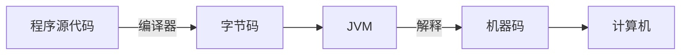
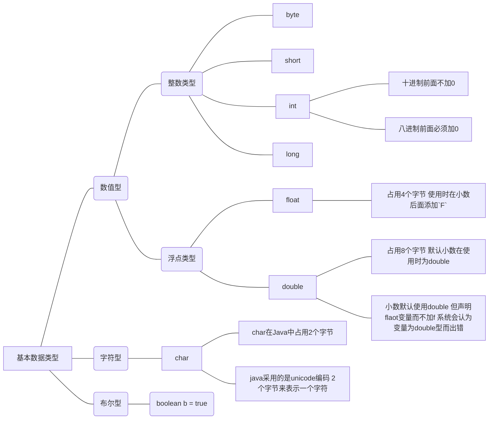
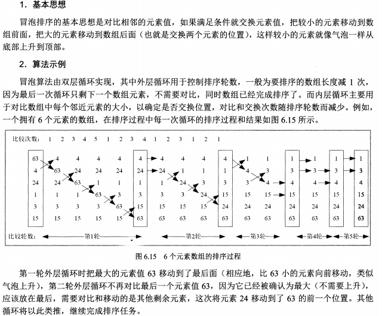
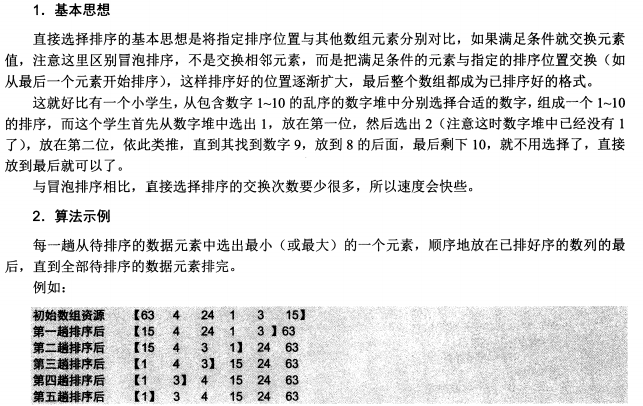
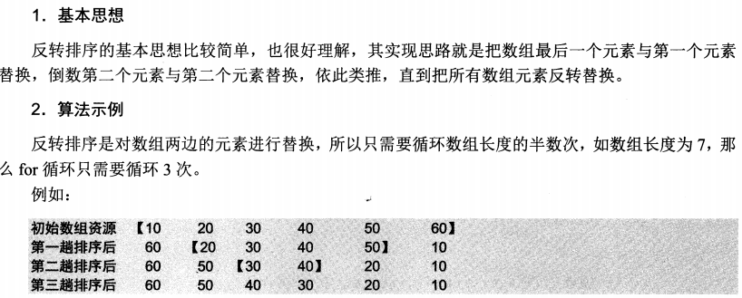
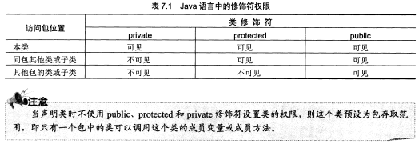

# JAVA 从入门到精通

[TOC]


##  Java 简介

- Java 是一种通过**解释**方式来执行的语言,语法规则和Ｃ＋＋类似。
- JAVA可以跨平台。
- JAVA既是编译型语言，又是解释型语言。
  - 程序代码经过编译后转换为一种称之为JAVA字节码的中间语言
  - JAVA虚拟机(JVM)对字节码进行解释和运行。
  - 程序编译只进行一次，而对于生成的字节码的解释则为：每执行一次程序就解释一次。




### JAVA的特性简介

- 简单：语法和C++类似，取消了多重继承，指针，实现了自动的垃圾回收
- 面向对象
- 分布性：操作和数据分布。操作分布是指在多个主机上布置相关操作；数据分布指将数据分别存放在多个不同的主机上，使用`URL`对象访问网络对象。
- 可移植性
- 解释型：编译生成的字节码独立于平台，不同平台的JVM对字节码进行解释。
- 健壮性
- 多线程：并行执行多项任务，类似于QQ软件里面的各种功能
- 高性能：JAVA编译后的代码运行在解释器中，所以速度比其他交互式的应用程序提高很多，还有字节码经过JVM翻译为了特定平台的机器码，从而进一步提高速度
- 动态：

### JAVA的第一个程序

- 文件名：Hello（文件名和`public class xxx`一致）

```java
public class Hello{
	public static void main(String[] args){
		System.out.println("Hello Java!\n");
	}
}
```

- 查看JAVA环境是否安装好：
  - 输入`java -version`
  - 再输入 `javac`

- 编译程序：`javac Hello.java`
  - 生成字节码`Hello.class`
  - 使用Linux平台的JVM，`java Hello `,执行结果：`Hello Java!`
  
- 简单语法格式：

  - 输出的格式：`printf("a + b = " + (a + b))`;使用加号来进行连接，和C++语言类似。
  - `println()` 会自动换行

## Java语法基础

###　JAVA主类结构

- JAVA是面向对象的语言

- 程序的基本组成单元是类

- 类中包括属性和方法

- 每一个应用程序都有一个类，含有`main()`方法的类成为主类

- 文件名称必须和类名同名，JAVA区分大小写

  ```java
  package Number; //声明该类所在的包
  public class test {
  	
  	static String s1 = "你好 JAVA";	//成员变量
  	public static void main(String[] args) {
  		//进行简单输出：
  		int a = 10;					//局部变量
  		int b = 20;					//局部变量
  		System.out.println(s1);
  		
  		System.out.println("a + b =" +(a + b));
  		System.out.println("a - b =" +(a - b));
  		System.out.println("a * b =" +(a * b));
  		System.out.println("a / b =" +(a / b));
  		System.out.println("a % b =" +(a % b));
  	}
  ```

- 通常将类的属性成为类的全局变量（成员变量）

- 通常将方法中的属性称为局部变量

- 区分的方法就是看变量定义的位置

-  **JAVA可在任意位置定义变量，与C++一致**

- `main()`方法为类的主方法，`public,static,void` 为`main()`方法的权限修饰符，静态修饰符和返回值修饰符

- JAVA程序中的`main()`方法必须声明为`public static void main(String[] args)`

- `String[] args`是一个字符串类型的数组，为`main()`方法的参数

  - C语言的主函数标准写法为`int main(int argc, char **argv)`

- 可以使用`import`关键字导入相关类

### 基本数据类型



```java
float c = 1.0;
//Type mismatch: cannot convert from double to float
float c = 1.0f;
```

- Java也可以把字符看作整数对待。Unicode采用的是无符号编码。
- Java可以处理所有国家的语言文字
- 使数据的强制转化来显性的显示整数和字符

```java
char word1 = 'd';
char word2 = '@';
int p1 = 23045;
int p2 = 45213;
System.out.println("d在unicode的位置为：\t" + (int)word1);
System.out.println("@在unicode的位置为：\t" + (int)word2);
System.out.println("unicode在表中23045位是：\t" + (char)p1);
System.out.println("unicode在表中45213位是：\t" + (char)p2);

/*
d在unicode的位置为：	100
@在unicode的位置为：	64
unicode在表中23045位是：	娅
unicode在表中45213位是：	낝
*/
```

- Java的标识符和关键字：
  - 标识符由数字，字母，下划线，美元符号组成
  - 不能以数字开头
  - 不能和关键字重复
- 关键字有47个
- 变量的定义
  - 系统的内存可以分为3区：系统区，程序区，数据区
  - 程序在执行时，程序代码加载到内存的程序区，数据暂存到数据区

- 常量的声明：
  - `final  double PI = 3.14159d;`
  - 常量必须在变量创建时就将其赋值。

```java
static final boolean BOOL = true; 

System.out.println("定义的常量为:\t" + BOOL);
//BOOL = false;
//The final field test.BOOL cannot be assigned
System.out.println("修改后的的常量为:\t" + BOOL);
/*
定义的常量为:	true
修改后的的常量为:	true
*/
```

- 变量的有效范围：
  - 成员变量（全局变量)：成员变量在整个类中有效
    - 类的成员变量分为两种，静态变量(类变量)`static int y = 10;`和实例变量`int x = 10;`
    - 静态变量的有效范围可以跨越
    - 静态变量不仅能在类内存取，还能以`类名.静态变量`的方式在类间使用
  - 局部变量：
    - 局部变量只在当前代码块内有效
    - 成员变量和局部变量名命名相同，将屏蔽成员变量

### 运算符

- 关于赋值运算符`=`
  - 从右向左运算
  - `a = b = c = d`,先将`d`的值赋给`c`,再将`c`的值赋给`b`,最后将`b`的值赋给`a`
- 算术运算符`+ - * / %`
  - 在进行除法时，除数不可以为0，如果为0，则会抛出`ArithmeticException`异常
- 自增和自减运算符
- 比较运算符：`> < >= <= == !=`
  - 关于浮点数之间的大小比较：`(a - b) < exp`
  - 不能直接使用`==`进行比较，因为浮点数在计算机中的存储并不精确
- 逻辑运算符：`&& || ！ &`
  - 关于`&&`，**只要第一个条件不满足，就不会执行后面的程序，直接进行下一步**
  - 关于`&`，**第一个条件不满足，也会接着执行后面的判断程序**

- 位运算符：`& | ～ ^` `<< >> >>>（无符号右移）`
  - 左移是向左移动，右边空的部分填为0
  - 右移是当符号位为1是，右移位填1
  - 无符号右移，最高位填充为0
  - 移位就是和乘法和除法相对应的
- 三元运算符:`条件式?值1:值2`
  - 条件为真，取值1
  - 条件为假，取值2
- 运算符优先级：尽量多用括号
  - `() 正负 增 算 比 逻 赋 `

### 数据的类型转化

- 总的原则：
  - 使用大内存，尽可能的套取内存的数据
- 强制类型转换：
  - 浮点数强制转换为整型，小数截止，主要是损失精度

### 流程控制

- `if()...else...`

- `if()... else if()...else...`

- `switch()...case...`,`switch()`的表达式的值必须是整数，字符型或者**字符串**类型

- 字符串类型是新加入的

  ```java
  package signed;
  
  public class signed {
  
  	public static void main(String[] args) {
  
  		String str = "mingtian nihao";
  		
  		switch(str) {
  		case "mingtian":
  			System.out.println("mingtian!\n");
  			break;
  		case "mingtian nihao":
  			System.out.println("mingtian nihao!\n");
  			break;
  		}
  	}
  }
  
  ```

- 循环语句：

  - `while`,先判断在执行

  - `do ... while()`,先执行，在判断，最少执行一次

  - `for（表达式1;表达式2;表达式3）`

    - 一次完整的`for`循环过程：

      - 1. 首先执行表达式1

        2. 下一步判断表达式2的条件，为真则进入，为假则跳出整个`for``循环

        3. 执行完循环体之后，执行表达式3，这样一轮就结束了

           下一步的开始是从判断表达式2的值开始的

  - `foreach`为`for`循环的简化版本，任何`foreach`都可以改写为`for`语言

    - ```
      for(元素变量x:遍历对象obj){
      	引用了x的Java语句；
      }
      ```

    - ```java
      package signed;
      
      public class signed {
      
      	public static void main(String[] args) {
      
      		int arr[] = {11,12,13,14,15,16,17,18,19,10};
      	
      		for(int x:arr){
      			System.out.println(x);
      		}
      	}
      }
      //自动判断截止条件，且x自动赋初值为0
      //功能:只是遍历一遍数组或者集合
      ```

  - `break` and `cuntinue`

    - `break` 是跳出当前的循环体，如果是嵌套循环，则只跳出最内层循环

    - `continue`是跳过本次循环，执行下一次循环

      ```java
      package signed;
      
      public class signed {
      
      	public static void main(String[] args) {
      	
      		for(int i = 0; i < 3; i++) {
      			for(int j = 0; j < 6; j++) {
      				if(j == 4)
      					//break;
      					continue;
      			
      			System.out.println("i = " + i + "\tj = " + j+ "\n");
      			}
      		}
      	}
      
      }
      /*使用break结果：
      i = 0	j = 0
      
      i = 0	j = 1
      
      i = 0	j = 2
      
      i = 0	j = 3
      .
      .
      .
      */
      //println()自动添加回车！！
      /*使用continue结果：
      i = 0	j = 0
      
      i = 0	j = 1
      
      i = 0	j = 2
      
      i = 0	j = 3
      
      i = 0	j = 5
      .
      .
      .
      */
      ```

    - `break + 标签名`，可以解决用`break`跳出所有循环

      ```java
      package signed;
      
      public class signed {
      
      	public static void main(String[] args) {
      	
      		loop:for(int i = 0; i < 3; i++) {
      			for(int j = 0; j < 6; j++) {
      				if(j == 4)
      					break loop;
      					//continue;
      			
      			System.out.println("i = " + i + "\tj = " + j+ "\n");
      			}
      		}
              System.out.println("ebd");
      	}
      }
      /*
      i = 0	j = 0
      i = 0	j = 1
      i = 0	j = 2
      i = 0	j = 3
      ebd
      */
      ```

    - 与C语言的异同：

      - break也是只能跳出内层循环
      - 无法使用`break + 标签名`，这个语法类似于`goto + 标签名`语句，但也有不同
      - 其实感觉这个`break +标签名 `并不很直观，直观上来讲，`标签名`应该放在嵌套循环的吓一跳执行语句。

    - `continue + 标签名`

      ```java
      package signed;
      
      public class signed {
      
      	public static void main(String[] args) {
      		loop:for(int i = 0; i < 3; i++) {
      			for(int j = 0; j < 6; j++) {
      				if(j == 4)
      					continue loop;
      			System.out.println("i = " + i + "\tj = " + j);
      			}
      		}
      	System.out.println("ebd");
      	}
      }
      /*
      i = 0	j = 0
      i = 0	j = 1
      i = 0	j = 2
      i = 0	j = 3
      i = 1	j = 0
      i = 1	j = 1
      i = 1	j = 2
      i = 1	j = 3
      i = 2	j = 0
      i = 2	j = 1
      i = 2	j = 2
      i = 2	j = 3
      ebd
      */
      ```

    - 重点理解`break + 标签名`

- 练习题：

  - 判断奇数还是偶数，并且打印出三角形和◇

    ```java
    package jiou;
    
    import java.util.Scanner;
    
    public class jishuOroushu {
    
    	public static void main(String[] args) {
    		
    		Scanner scanner = new Scanner(System.in);
    		int x = scanner.nextInt();
    		if(0 ==(x % 2))
    			System.out.println("偶数");
    		else 
    			System.out.println("奇数");
    		System.out.println("结束奇数和偶数判断");
    		/*
    		 * 1.先通过嵌套for循环画出空格来，第一行为x-1个空格，第二行为x-2个空格...
    		 * 2.在1的基础上在增加一个并列for循环，用来输出*，按照1,3，5,7,9,11，..
    		 * 3.将其翻一下，达到下三角，一组合成为◇
    		*/
    		for(int i = x-1 ; i >= 0; i --) {
    			for(int j = 0; j < i; j ++) {
    				System.out.print(" ");
    				}
    			for(int k = 0; k < (x -i -1)*2 + 1; k ++) {
    				System.out.print("*");
    			}
    			System.out.print("\n");
    		}
    		
    		for(int i = 1 ; i <  x; i ++) {
    			for(int j = 0; j < i; j ++) {
    				System.out.print(" ");
    				}
    			for(int k = 0; k < (x -i -1)*2 + 1; k ++) {
    				System.out.print("*");
    			}
    			System.out.print("\n");
    		}
    		
    		scanner.close();
    	}
    }
    /*
    6
    偶数
    结束奇数和偶数判断
         *
        ***
       *****
      *******
     *********
    ***********
     *********
      *******
       *****
        ***
         *
    */
    ```

## 字符串

### String类

- 字符串的创建

  ```java
  //1.字符串的创建
  char a[] = {'G','o','o','d'};
  String str1 = new String(a);
  //等价于
  String str1 = new String("Good");
  
  //2.字符串的提取
  //String str2 = new String(char a[], int offset, int length);
  String str2 = new String("Good",2,1);
  //result:"oo"
  
  //3.字符串常量的引用：
  String str1，str2;
  str1 = "We are students";
  str2 = "We are students";
  //在这里“We are students”存放在常量区，能被寻址，不可被修改
  //在这里的str1 和str2 表示的是一个地址
  ```

- 字符串的连接,使用`+`进行连接:

  ```java
  String str1 = "Hello ";
  String str2 = "World! ";
  String str3 = str1 + str2;
  //resault:str3 = "Hello World! ";
  ```

  - 注意点：多行打印语句也使用`+`进行连接

    ```java
    System.out.print("I like
    					java");
    //err
    System.out.print("I like" +
    					"java");
    ```

  - 字符串连接其他数据类型，会将其他数据类型转换为字符串在进行输出

```java
int a = 10;
int b = 20;
System.out.println(string + " a = " +a + " b = " +b);
//Hello World! a = 10 b = 20
```

- 获取字符串信息

  - 获取字符串长度：
    - `str.length()`返回值为`int`，不包括`\0`
  - 字符串查找：
    - `str.index(String s)`返回值为指定字符串首次出现的位置，没有返回`-1`
    - `str.lastIndexOf(String s)`,返回值为指定字符串最后一次出现的位置，没有返回`-1`
  - 获取指定索引位置的字符：
    - `str.charAt(int index)`,返回值为指定索引位置的字符

- 字符串操作：

  - 都是利用字符串的下标进行操作的，字符串下标默认从0开始

  - 获取字符串：

    - `str.substring(int beginIndex)`,返回值为从指定索引值开始到字符串结尾
    - `str.substring(int beginIndex,int endIndex)`,返回值为首尾的字符串

  - 去除空格：

    - `str.trim()`返回的是字符串的副本，忽略空格

  - 字符串替换：

    - `str.replace(char oldChar,char newChar)`,成功返回新字符串，失败返回原字符串

  - 判断字符串的开始和结尾：

    - `str.startsWith(string prefix)`判断当前字符串对象的前缀是否为指定的字符串
    - `str.endsWith(string suffix)`判断当前字符串对象的后缀是否为指定的字符串

  - 判断字符串是否相等：

    ```java
    String tom = new String("I am a Student!");
    String jerry = new String("I am a Student!");
    boolean b = (tom == jerry);
    ```

    - 判断字符串的字符(区分大小写)和长度是否相等：
      - `str.equals(String otherstr)`
    - 判断字符串的字符(不区分大小写)长度是否相等：
      - `str.equalsIgnoreCase(String otherstr)`
    - 按照字典顺序比较两个字符串：
      - `str.compareTo(String otherstr)`
      - `compareTo()方法只有在equals()方法返回true时才返回0`
    - 字母的大小写转换：
      - `str.toLowCase()`
      - `str.toUpperCase()`
      - 在进行大小写转换时，非字符不受影响
    - 字符串的分割：
      - `str.splite(String sign, int limit)`
      - 该方法可以根据给定的分隔符对字符串进行拆分，并且限定拆分的次数

- 格式化字符串：（两种格式）

  - `str.format(String Object...args)`

  - `str.format(Local 1,String Object...args)`,进行本地化

    ```java
    import java.util.Date;
    public class test {
    	public static void main(String[] args) {
    		Date date = new Date();
    		String year = String.format("%tY", date);
    		String month = String.format("%tB", date);
    		String day = String.format("%td", date);
    		System.out.println("今年是： " + year + " 年");
    		System.out.println("今月是： " + month + " 月");
    		System.out.println("今天是： " + day + " 日");
    	}
    }
    /*
    今年是： 2019 年
    今月是： April 月
    今天是： 29 日
    */
    ```

    

- 使用正则表达式：

  - 正则表达式通常用与判断语句中，用于检查某一字符串是否满足某一格式

  - 在正则表达式中，“.”表示任何一个字符，所以想在正则表达式中使用普通的点符号，必须使用转义字符

    ```java
    
    public class test {
    	public static void main(String[] args) {
    		String regex = "\\w+@\\w+(\\.\\w{2,3})*\\.\\w{2,3}";
    		String str1 = "aaa@";
    		String str2 = "aaaa";
    		String str3 = "aaa@111ffyu.dtf.com";
    		if(str1.matches(regex))
    			System.out.println(str1 + " 是一个合法的Email地址格式");
    		if(str2.matches(regex))
    			System.out.println(str2 + " 是一个合法的Email地址格式");
    		if(str3.matches(regex))
    			System.out.println(str3 + " 是一个合法的Email地址格式");
    
    	}
    }
    //aaa@111ffyu.dtf.com 是一个合法的Email地址格式
    /*
    "\\w+@\\w+(\\.\\w{2,3})*\\.\\w{2,3}";
    \\w 代表可用作比标识符的字符，不包括“$”
    + 表示1或者多次
    \\. 表示转义字符‘.’
    \\w{2,3} 表示出现2~3次
    * 表示出现0次或者多次
    */
    ```

    

## 数组

### 一维数组的创建和使用

- 声明一维数组：2

  - `int array[]`
  - `int[] array`
  - 就是方括号的位置的不同

- 定义一维数组：

  - `int array[] = new int[5];`
  - 使用`new`关键字为数组分配内存时，整型数组中各个元素的初始值为0

- 初始化一维数组：2

  - `int array[] = new int[]{1,2,3,4,5};`

  - `int array2[] = {1,2,3,4,5};`

    ```java
    package array;
    public class test{
    	public static void main(String[] args) {
    		//先声明在定义
    		int array1[];
    		array1 = new int[] {1,2,3,4,5};
    		//直接进行定义:有两种
    		int array2[] = new int[]{11,22,33,44,55};
            int array3[] = {1,2,3,4,5};
    		//foreach语法
    		for(int i:array1)
    		{
    			System.out.println(i);
    		}
    		for(int i:array2)
    		{
    			System.out.println(i);
    		}
    	}
    }
    ```

### 二维数组的创建和使用

- 第一个元素表示**行**，第二个元素表示**列**
- 二维数组的声明：
  - `int array1[][];`
  - `int[][] array1; `

- 二维数组的创建及其初始化：

  - `int array1[][] = new int[2][4];`

    ```
    int array1[][] = new int[2][];
    array1[0] = new int[2];
    array1[1] = new int[3]；
    ```

  - `int array[][] = {{1,2},{3,4}};`

- 二维数组的使用：使用2个`for`循环进行遍历

### 数组的基本操作

- 遍历数组：

  - 一维数组可以使用`foreach`
  - 二维数组可以使用`嵌套for循环`

- 填充替换数组元素：

  - `Arrays.fill(int[] array1, int value);`
  - `Arrays.flii(int[] array1,int fromIndex,toIndex,int value);`
    - 包括第一个索引值，但是不包括最后一个索引值

- 对数组进行排序：

  - `Arrays.sort(obj)`
  - Java中的String类型的数组的排序算法是根据字典编排顺序排序的，因此数字排在字母前面，大写字母排在小写字母前面。

- 数组的复制：

  - `Arrays.copyOf(arr,int length)`

- 数组的排序算法

  - 冒泡排序：
    -  每次循环都将最大或者最小的元素排列在最后
    - 使用嵌套for循环
    - 

  - 直接选择排序：

    - 

    

  - 反转排序：

    - 

  - 算法：

    ```java
    package array;
    public class test{
    	public static void main(String[] args) {
            
    		System.out.println("------冒泡排序------");
    		int array[] = {63,4,24,1,3};
    		for(int i = 1; i < array.length; i++) {
    			for(int j = 0; j < array.length - i; j++) {
    				if (array[j] > array[j + 1]) {
    					int temp = array[j];
    					array[j]  = array[j + 1];
    					array[j + 1] = temp;
    				}
    			}
    		}
    		for(int i :array)
    			System.out.println(i);
    		
    		System.out.println("------直接选择排序开始------");
    		int index = 0;
    		for(int i = 1; i < array.length; i++) {
    			index = 0;
    			for(int j = 1; j <= array.length - i; j++) {
    				if(array[j] > array[index]) {
    					index = j;
    				}
    			}	
    		int temp = array[array.length - i];
    		array[array.length - i] = array[index];
    		array[index] = temp;
    	}
    		for(int i :array)
    			System.out.println(i);
            
    		System.out.println("------反转排序开始------");
    		//int array[] = {1,4,24,63,3};
    		for(int i = 0; i < (array.length)/2; i++ ) {
    			int temp = array[i];
    			array[i] = array[(array.length) -i -1];
    			array[(array.length) -i -1] = temp;
    		}
    		for(int i :array)
    			System.out.println(i);
    	}
    }
    ```

    

## 类和对象

- 在Java中经常提及的两个词语是类和对象，实际上可以把类看作是对象的载体，他定义了对象所具有的功能。
  - 类是对同一类事物的共同描述。
  - 对象在符合类的基础上所产生出来的实例。
  - 类是封装对象和行为的载体。
- 封装
  - 将对象的属性和行为封装起来，其载体就是类。
- 继承：
  - 继承了公共属性，又添加了特有的属性
- 多态：
  - 接口的多种不同实现方式称之为多态

### 类

- 成员变量

  - 在`class`里面定义的

- 成员方法

  - 成员函数

- 权限修饰符

  - `public` 所有类均可见

  - `private`仅本类可见

  - `protect`仅本类和同包类可见，其他包的类不可见

  - 未指定是，只有同包类可调用

    

- 局部变量

  - 方法内定义的变量
  - 在执行时创建，在执行完成后销毁
  - **局部变量必须初始化**

- 局部变量的有效范围

  - 只在成员方法内有效
  - 方法内定义的变量个成员变量重名，会因为作用域的问题而使得成员变量失效

- this关键字

  - this是引用的本类的一个对象

### 静态变量，常量和方法

- 在静态方法中不可以使用`this`关键字
- 在静态方法中不可以直接使用非静态方法
- 在方法内部不能声明局部变量为`static`

### 类的主方法

- `public static void main(String[] args)`
  - 主方法是静态的，静态方法中必须调用静态方法
  - 主方法无返回值
  - 主方法的形参为数组，`args[0]`...为参数
    - `args[0]`不包括`java xxx.class` 

### 对象

- 对象的创建：

  - `Test test =new Test() `
  - `Test test =new Test("asss") `

- ```java
  public class StructClass{
      public StructClass(){ //构造方法
          System.out.println("创建对象！！");
      }
      public static void main(String[] args){
  
          new StructClass();
      }
  }
  
  //创建对象！
  //在创建对象的同事，将自动调用构造方法中的代码
  ```

- ```java
  public class TransferClass{
      //static int i = 47;
      int i =  47;
      public void call(){
          System.out.println("调用call方法");
          for(i = 0; i < 3 ;i++){
              System.out.println(i + "\t");
              if(i == 2)
                  System.out.print("\n");
          }
      }
      public TransferClass(){
          System.out.print("创建TransferClass对象\n");
      }
  
      public static void main(String[] srgs){
          TransferClass tc1 = new TransferClass();
          TransferClass tc2 = new TransferClass();
          tc1.i = 60;
          System.out.print("第一个实例化对象tc1调用变量i的结果为：" + tc1.i + "\n");
          tc2.i = 30;
          System.out.print("第二个实例化对象tc1调用变量i的结果为：" + tc2.i + "\n");
          tc1.call();
          tc2.call();
      }
  }
  
  /**
  
  创建TransferClass对象
  创建TransferClass对象
  第一个实例化对象tc1调用变量i的结果为：60
  第二个实例化对象tc1调用变量i的结果为：30
  调用call方法
  0
  1
  2
  调用call方法
  0
  1
  2
  
  //两个对象是独立的内存,在这里i使用的是非静态变量
   */
  ```

- ```java
  /*
  使用静态变量对象：
  创建TransferClass对象
  创建TransferClass对象
  第一个实例化对象tc1调用变量i的结果为：60
  第二个实例化对象tc1调用变量i的结果为：60
  调用call方法
  0
  1
  2
  调用call方法
  */
  //静态变量对象使用的是同一块内存区域
  ```

- 对象的比较

  - 分为`== `和`equals()`方法

  - ```java
    public class equals{
    
        public static void main(String[] args){
    
            String s1 = new String("abc");
            String s2 = new String("abc");
            String s3 = s1;
            System.out.println("s2 == s3 的运算结果为：" + (s2 == s3));
            System.out.println("s1 == s3 的运算结果为：" + (s1 == s3));
            System.out.println("s2.equals(s3) 的运算结果为：" + s2.equals(s3));
    
        }
    }
    /*
    
    s2 == s3 的运算结果为：false
    s1 == s3 的运算结果为：true
    s2.equals(s3) 的运算结果为：true
    */
    ```

  - `== `比较的是内存地址是否相同，`s1and s3`引用指向同一内存地址

  - `equals()`比较的是`String`的内容是否相同

### 对象的销毁：

- 每个对象都有一个生命周期，当对象的生命周期结束之后，分配给对象的内存地址会被回收，其他语言需要手动回收，而Java有一套完整的垃圾回收机制
- 什么情况下会被视为垃圾：
  - 对象的引用超过其作用范围
  - 将对象赋值为`null`
- 虽然垃圾回收机制很完善，但是垃圾回收机制只能回收`new`操作符创建的对象
  - 在Java中提供了一个`finalize()`方法，这个方法是`Object`的方法，被声明为`protected`,如果用户定义了这个方法，在垃圾回收时会首先调用该方法，在下一次垃圾回收动作发生时，才能真正的回收被对象占用的内存。
  - 垃圾回收或者`finalized`并不能保证一定会发生，当JVM的内存耗尽时，它是不会执行垃圾回收的
  - 垃圾回收不受人为控制，具体的执行时间也不确定，所以`finalized`方法也就无法执行，为此Java提供了一种`System.gc()`方法来强制启动垃圾回收器。