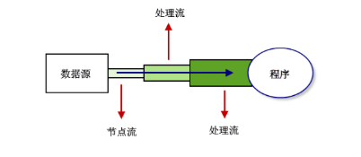

# Java之IO技术

- 数据的输入输出

  - 缓冲方式
  - 无缓冲方式

- 数据源的分类：

  - 源设备：一般对应为输入流，数据的发送的设备
  - 目标设备：一般对应于输出流，数据接收的设备

- Stream:

  - 流是一个抽象的，动态的概念，是一连串连续动态的数据集合
  - 源设备和目标设备就像两个水箱，通过流充当水管传输数据

- 经典读文件操作：

  ```java
  /**
   * 使用文件流读取文件内容
   * 此程序属于目标设备
   * 文件内容为目标设备的输入流
   */
  import java.io.*;
  
  public class test{
      public static void main(String[] args){
  
          FileInputStream fp = null;
  
          try{
              /*使用反斜杠*/
              fp = new FileInputStream("D:/a.txt");
  
              StringBuilder sb = new StringBuilder();
              int temp = 0;
  
              while((temp = fp.read()) != -1){
                  sb.append((char)temp);
              }
              System.out.println(sb);
          }catch(Exception e){
              e.printStackTrace();
          }finally{
              try{
                  if(fp != null){
                      fp.close();
                  }
               } catch(IOException e){
                      e.printStackTrace();
                  }
          }
      }
  }
  ```

## 流的概念细分:

- 按照流的方向：

  - 输入流：数据流向是数据源到程序
  - 输出流：数据流向是程序到数据源

- 按照流的数据单元分类：

  - 字节流：一般以`Stream`结尾
  - 字符流：一般以`Read/Write`结尾

- 按照处理对象不同：

  - 节点流：可以直接从数据的目的地读取数据

  - 处理流：是处理流的流

    

    

## 四大IO抽象类

- `InputStream`: 
  - `int read()` 读取一个字节数据，并且将字节的值作为int类型(0~255)返回
  - `void close()`:关闭输入流对象，释放系统相关资源
- `OutputStream`:
  - 同上
- `Reader`:
  - 用于读取字符，读取一个字符，并且经字符的值作为int类型返回(0~65535，即Unicode值)，如果未读出字符则返回-1
- `Writer`

## 使用字节流文件复制操作

```java
/**
 * 实现文件的复制操作
 * 字符和字节的区别
 *不提倡使用文件字节流
 */
import java.io.*;

public class test2{
    public static void main(String[] args){
        FileOutputStream fdst = null; //数据输出到文件
        FileInputStream  fsrc = null; //数据输入到程序
        byte[] buffer = new byte[1024];
        int temp = 0;
        try{
            /*得到源文件和目标文件的地址 */
            fsrc = new FileInputStream("D:/a.txt");
            fdst = new FileOutputStream("D:/b.txt",false);
            /**将从文件中读取到的字符存放到buffer数组中 */
            while((temp = fsrc.read(buffer)) != -1){
                /**将数组元素写入到文件中 */
                /**如果只使用write（buffer），则会写入1024个字符*/
                fdst.write(buffer,0,temp);
            }
        }catch(Exception e){
            e.printStackTrace();
        }finally{
            try{
                if(fsrc != null){
                    fsrc.close();
                }
            }catch(IOException e){
                    e.printStackTrace();
            }

             try{
                if(fdst != null){
                    fdst.close();
                }
            }catch(IOException e){
                    e.printStackTrace();
            }

        }
    }


}
```

## 使用字符流实现文件复制

```java
/**
 * 使用字符流实现文件的复制操作
 */
import java.io.*;

public class test3{
    public static void main(String[] args){
        FileWriter fdst = null; //数据输出到文件
        FileReader  fsrc = null; //数据输入到程序
        char[] buffer = new char[1024];
        int temp = 0;
        try{
            /*得到源文件和目标文件的地址 */
            fsrc = new FileReader("D:/a.txt");
            fdst = new FileWriter("D:/b.txt",false);
            /**将从文件中读取到的字符存放到buffer数组中 */
            while((temp = fsrc.read(buffer)) != -1){
                /**将数组元素写入到文件中 */
                fdst.write(buffer,0,temp);
            }


        }catch(Exception e){
            e.printStackTrace();
        }finally{
            try{
                if(fsrc != null){
                    fsrc.close();
                }
            }catch(IOException e){
                    e.printStackTrace();
            }

             try{
                if(fdst != null){
                    fdst.close();
                }
            }catch(IOException e){
                    e.printStackTrace();
            }

        }
    }


}
```

## 缓冲字节流

- 不具有IO流的输入输出功能

- 只是再别的流上加上缓冲功能，用以提高效率

- 缓冲流是一种处理流

- 在关闭流的过程中，后开的先关闭

- 缓存区的大小为8192，可以自己通过构造方法指定 

  ```java
  /**
   * 使用缓冲字节流来提高效率
   * 不需要定义缓冲数组
   * 默认缓冲区为8192
   */
  import java.io.*;
  
  public class test4{
      public static void main(String[] args){
  
          FileInputStream fsrc = null;
          BufferedInputStream ffsrc = null;
  
          FileOutputStream fdst = null;
          BufferedOutputStream ffdst = null;
          int temp = 0;
          try{
  
              fsrc = new FileInputStream("D:/a.txt");
              ffsrc = new BufferedInputStream(fsrc);
  
              fdst = new FileOutputStream("D:/b.txt");
              ffdst = new BufferedOutputStream(fdst);
  
              while((temp = ffsrc.read()) != -1){
                  ffdst.write(temp);
              }
  
          }catch(Exception e){
              e.printStackTrace();
          } finally{
              
              try{
                  if(ffdst != null){
                      ffdst.close();
                  }
              }catch(IOException e){
                  e.printStackTrace();
              }
  
              try{
                  if(fdst != null){
                      fdst.close();
                  }
              }catch(IOException e){
                  e.printStackTrace();
              }
  
              try{
                  if(ffsrc != null){
                      ffsrc.close();
                  }
              }catch(IOException e){
                  e.printStackTrace();
              }
  
              try{
                  if(fsrc != null){
                      fsrc.close();
                  }
              }catch(IOException e){
                  e.printStackTrace();
              }
          
          
          
          }
      }
  }
  ```

## 缓冲字符流

- `readLine()`方法是`BufferedReader`特有的方法

- 写入一行后一定要记得使用`newLine()`方法换行

  ```java
  /**
   * 使用缓冲字符流来提高效率
   * 不需要定义缓冲数组
   * 默认缓冲区为8192
   */
  import java.io.*;
  
  public class test5{
      public static void main(String[] args){
  
          FileReader fsrc = null;
          BufferedReader ffsrc = null;
  
          FileWriter fdst = null;
          BufferedWriter ffdst = null;
          String string = " ";
          try{
  
              fsrc = new FileReader("D:/a.txt");
              ffsrc = new BufferedReader(fsrc);
  
              fdst = new FileWriter("D:/b.txt");
              ffdst = new BufferedWriter(fdst);
  
              while((string = ffsrc.readLine()) != null){
                  ffdst.write(string);
                  ffdst.newLine();
              }
  
          }catch(Exception e){
              e.printStackTrace();
          } finally{
              
              try{
                  if(ffdst != null){
                      ffdst.close();
                  }
              }catch(IOException e){
                  e.printStackTrace();
              }
  
              try{
                  if(fdst != null){
                      fdst.close();
                  }
              }catch(IOException e){
                  e.printStackTrace();
              }
  
              try{
                  if(ffsrc != null){
                      ffsrc.close();
                  }
              }catch(IOException e){
                  e.printStackTrace();
              }
  
              try{
                  if(fsrc != null){
                      fsrc.close();
                  }
              }catch(IOException e){
                  e.printStackTrace();
              }
          }
      }
  }
  ```

  

## 字节数组流

- `ByteArrayInputStream`和`ByteArrayOutputStream`用在需要流和数组之间转化

- 其本质上和`FileInputStream`的作用相似，`ByteArrayInputStream`则是将存储在内存的字节数组对象当做数据源

  ```java
  /**
   * 字节数组流
   */
  
   import java.io.*;
  
   public class test6{
       public static void main(String[] args){
          /**将字符串转变为字节数组 */
          byte[] b = "wyk".getBytes();
          test(b);
       }
  
       public static void test(byte[] b){
           ByteArrayInputStream bais = null;
           StringBuilder sb = new StringBuilder();
           int temp = 0;
           int num = 0;
           try{
                /** ByteArrayInputStream是把内存中的”某个字节数组对象”当做数据源。 */
               bais = new ByteArrayInputStream(b);
               while((temp = bais.read()) != -1){
                   sb.append((char)temp);
                   num ++;
               }
               System.out.println(sb);
               System.out.println("读取的字节数： " + num);
           }finally{
               try{
                   if(bais != null){
                       bais.close();
                   }
               }catch(IOException e){
                   e.printStackTrace();
               }
           }
       }
   }
  
  
  ```

## 数据流

- 数据流是将**基本数据类型与字符串类型**作为数据源，从而允许程序以与机器无关的方式从地城输入输出六中操作Java基本数据类型和字符串类型

- `DataInputStream`和`DataOutputStream`是处理流，可以对其他节点流或者处理流进行包装

  ```java
  /**
   * 数据流实现文件的读取
   */
  import java.io.*;
  
  public class test7{
      public static void main(String[] args){
          /**文件读取数据 */
          DataInputStream Dfsrc = null;
          FileInputStream fsrc = null;
          /**文件写入数据 */
          DataOutputStream Dfdst = null;
          FileOutputStream fdst = null;
  
          try{
              fsrc = new FileInputStream("D:/a.txt");
              Dfsrc = new DataInputStream(new BufferedInputStream(fsrc));
  
              fdst = new FileOutputStream("D:/a.txt");
              Dfdst = new DataOutputStream(new BufferedOutputStream(fdst));
  
              Dfdst.writeChar('v');
              Dfdst.writeInt(20);
              Dfdst.writeDouble(Math.random());
              Dfdst.writeBoolean(true);
              /**手动刷新缓冲区，将流中数据写入到文件中 */
              Dfdst.flush();
  
              System.out.println("char   : " + Dfsrc.readChar());
              System.out.println("Int    : " + Dfsrc.readInt());
              System.out.println("Double : " + Dfsrc.readDouble());
              System.out.println("Boolean: " + Dfsrc.readBoolean());
  
          }catch(IOException e){
              e.printStackTrace();
          } finally{
              try{
  
                  if(Dfdst != null){
                      Dfdst.close();
                  }
              }catch(IOException e){
                  e.printStackTrace();
              }
  
              try{
  
                  if(fdst != null){
                      fdst.close();
                  }
              }catch(IOException e){
                  e.printStackTrace();
              }
  
              try{
  
                  if(Dfsrc != null){
                      Dfsrc.close();
                  }
              }catch(IOException e){
                  e.printStackTrace();
              }
  
              try{
  
                  if(fsrc != null){
                      fsrc.close();
                  }
              }catch(IOException e){
                  e.printStackTrace();
              }
          }
      }
  }
  ```

  - 使用数据流时：
    - 读取顺序一定要与写入顺序一致
    - 否则不能正确读取数据

## 对象流

- 对象流不仅可以读写对象，还可以读写基本数据类型

- 使用对象流读写对象，该对象必须序列化和反序列化

- 系统提供的类已经实现了序列化接口，自定义类必须手动实现序列化接口

  ```java
  import java.io.*;
  
  public class test8{
      public static void main(String[] args) throws IOException,
      ClassNotFoundException{
          write();
          read();
  
      }
  
      public static void write(){
          OutputStream os = null;
          BufferedOutputStream bos = null;
          ObjectOutputStream oos = null;
          try{
              /**创建输出对象，增加缓冲功能，创建Object输出流 */
              os = new FileOutputStream(new File("D:/a.txt"));
              bos = new BufferedOutputStream(os);
              oos = new ObjectOutputStream(bos);
  
              oos.writeChar('a');
              oos.writeInt(10);
              oos.writeDouble(Math.random());
              oos.writeBoolean(true);
          }catch(IOException e){
              e.printStackTrace();
          }finally{
              try{
                  if(oos != null){
                      oos.close();
                  }
              }catch(IOException e){
                      e.printStackTrace();
              }
  
              try{
                  if(bos != null){
                      bos.close();
                  }
              }catch(IOException e){
                      e.printStackTrace();
              }
  
              try{
                  if(os != null){
                      os.close();
                  }
              }catch(IOException e){
                      e.printStackTrace();
              }
  
          }
      }
      public static void read(){
  
          InputStream is = null;
          BufferedInputStream bis = null;
          ObjectInputStream ois = null;
          try{
              /**创建输出对象，增加缓冲功能，创建Object输出流 */
              is = new FileInputStream(new File("D:/a.txt"));
              bis = new BufferedInputStream(is);
              ois = new ObjectInputStream(bis);
  
             System.out.println(ois.readChar());
             System.out.println(ois.readInt());
             System.out.println(ois.readDouble());
             System.out.println(ois.readBoolean());
          }catch(IOException e){
              e.printStackTrace();
          }finally{
              try{
                  if(ois != null){
                      ois.close();
                  }
              }catch(IOException e){
                      e.printStackTrace();
              }
  
              try{
                  if(bis != null){
                      bis.close();
                  }
              }catch(IOException e){
                      e.printStackTrace();
              }
  
              try{
                  if(is != null){
                      is.close();
                  }
              }catch(IOException e){
                      e.printStackTrace();
              }
          }
      }
  
  }
  ```

## 转换流

- `InputStreamReader/OutputStreamWrite用来实现将字节流转换为字符流
- `System.in` 是字节流对象，代表键盘输入
  - 如果我们想要按照行接收用户输入时，就必须使用`BufferedReader`特有的方法`readLine`
  - `BufferedReader`的构造方法的参数为一个`Reaaer`对象，这时候就可以使用转换流了
- `System.out`是字节流对象，代表屏幕输出
  - 将字符输出到控制台，就需要用到`write`方法，所以我们要使用`OutputStreamWrite`将字节流转换为字符流

```java
/**
 * 转换流
 */
import java.io.*;

public class test9{
    public static void main(String[] args){
        /**创建字符流引用 */
        BufferedReader br = null;
        BufferedWriter bw = null;
        try{
            /**创建字符流对象 */
            br = new BufferedReader(new InputStreamReader(System.in));
            bw = new BufferedWriter(new OutputStreamWriter(System.out));
            /**使用字符输入和输出流 */
            /*按键复现*/
            String string = br.readLine();
            while(!"exit".equals(string)){
                bw.write(string);
                bw.newLine();
                bw.flush();
                string = br.readLine();
            }

        }catch(IOException e){
            e.printStackTrace();
        }finally{
            try{
                if(bw != null){
                    bw.close();
                }
            }catch(IOException e){
                e.printStackTrace();
            }

            try{
                if(br != null){
                    br.close();
                }
            }catch(IOException e){
                e.printStackTrace();
            }
        }
    }
}
```

## 序列化和反序列化

- 当两个进程远程通信时，彼此可以发送各种类型的数据
- 无论何种数据类型，都会以二进制序列的形式在网络上发送
  - 我们可以通过`http`协议发送字符串信息，我们也可以在网络上直接发送Java对象
  - 发送方需要把Java对象转换为字节系列
  - 接收方需要把字节序列再次恢复为Java对象才能正常读取
- 把Java对象转换为字节序列称之为对象的序列化
- 把字节序列恢复为Java对象的过程称之为对象的反序列化
- 对象序列化的作用：
  - 持久化：把对象的字节序列永久的保存在硬盘上，通常放在一个文件中
  - 网络通信：在网络上传输对象的字节序列

## 序列化涉及的类和接口

- `ObjectOutputStream`代表对象输出流，他的`writeObject(Object obj)`方法可以实现对参数指定的obj对象进行路泪花，把得到的字节序列写入到一个目标输出流中
- `ObjectInputStream` 代表对象流输入，它的`readObject(Object obj)`方法可以实现从一个源输入六中读取字节序列，再把他们反序列为一个对象，并将其返回
- 只有实现了`Serializable`接口类的对象才能被序列化，`Serializable`接口是一个空接口，只是起到标记作用

```java

import java.io.*;

public class test10{
    public static void main(String[] args){
        /**变量引用 */
        FileOutputStream fos = null;
        FileInputStream fis = null;
        ObjectOutputStream oos = null;
        ObjectInputStream  ois = null;

        try{
            /**定义对象实体 */
            Person person = new Person(24, true, "王永坤");
            System.out.println(person);

            fos = new FileOutputStream("D:/a.txt");
            fis = new FileInputStream("D:/a.txt");
            oos = new ObjectOutputStream(fos);
            ois = new ObjectInputStream(fis);

            oos.writeObject(person);
            oos.flush();

            Person p = (Person)ois.readObject();
            System.out.println(p);


        /**这个catch必须添加，若不添加则会出现错误：未报告的异常错误ClassNotFoundException; 必须对其进行捕获或声明以便抛出 */
        }catch(ClassNotFoundException e){
            e.printStackTrace();
        }catch(IOException e){
            e.printStackTrace();
        }finally{
            try{

                if(ois != null){
                    ois.close();
                }
            }catch(IOException e){
                e.printStackTrace();
            }

            try{

                if(oos != null){
                    oos.close();
                }
            }catch(IOException e){
                e.printStackTrace();
            }

            try{

                if(fis != null){
                    fis.close();
                }
            }catch(IOException e){
                e.printStackTrace();
            }

            try{

                if(fos != null){
                    fos.close();
                }
            }catch(IOException e){
                e.printStackTrace();
            }

        }
    }
}

/**Person 类的实现Serializable接口后，Person对象才能被序列化 */
class Person implements Serializable{
    /**添加序列ID后，他决定着是否能够反序列化 */
    private static final long serialVersionUID = 1L;
    /**属性 */
    int age;
    boolean isMan;
    String name;
    /**构造函数 */
    public Person(int age, boolean isMan, String name){
        super();
        this.age = age;
        this.isMan = isMan;
        this.name = name;
    }
    /**toString函数重写 */
    @Override
    public String toString(){
        return "Person: [ age = " + age + ", isMan = " + isMan + ", name = " + name + " ]";
    }
}
```

- 注意点：
  - `static `属性不参与序列化
  - 对象中的某些属性若不想被序列化，不能使用`static` ,而是使用`transient`
  - 为了防止读和写的序列化ID不一致，一般指定一个固定的序列化ID

## 装饰器模式

- 举例说明：
  - 智能手机通过加装投影组件，实现原有手机的拓展
  - 未来给普通人加装外骨骼装饰

```java
/**
 * 装饰器模式
 */

import java.io.*;

public class test11{
    public static void main(String[] args){
        Iphone iPhone = new Iphone("iPhone3.0");
        iPhone.show();
        System.out.println("********装饰后********");
        TouYingIPhone touYingIPhone = new TouYingIPhone(iPhone);
        touYingIPhone.Show();
    }
}
/**手机类 */
class Iphone {
    private String name;
    public Iphone(String name) {
        this.name = name;
    }
    public void show() {
        System.out.println("我是" + name + ",可以在屏幕上显示");
    }
}
/*装饰器模式*/
class TouYingIPhone{
    public Iphone iphone;
    public TouYingIPhone(Iphone iphone){
        this.iphone = iphone;
    }

    public void Show(){
        iphone.show();
        System.out.println("还可以投影，在墙壁上显示");
    }

}
```

## IO流体系中的装饰器模式

- IO流体系中大量使用了装饰器模式

## Apcche IOUtils 和 FileUtils的使用

- 只进行上述的IO操作，在进行复杂操作时也需要大量编程工作
- Apache-commons工具包中提供了IOUtils/FileUtils，可以让我们非常方便的对文件和目录进行操作。 