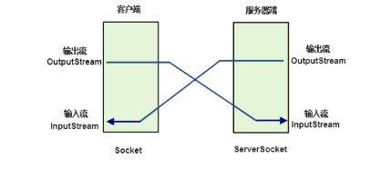

# 基本概念

- 什么是计算机网络：
  - 计算机网络是将不同的计算机通过线路连接起来，在网络操作系统，网络管理软件和网络通信协议的管理和协调下，实现资源共享和信息传递
- 计算机通信协议：
  - OSI（开放系统互联）7层模型
    - 应用层
    - 表示层
    - 会话层
    - 传输层
    - 网络层
    - 链路层
    - 物理层
- TCP/IP协议：
  - 应用层（OSI的应用层，表示层，会话层）
  - 传输层
  - 网络层
  - 网络接口层（数据链路层，物理层）
- IP地址：
  - 用来标识网络中的一个通信实体的地址
  - 主要使用IPV4
    - 32位地址，分为4组，每组为0~255
  - 注意：
    - IP地址：`127.0.0.1` 标识本机地址
    - IP地址：`192.168.00~192.168.255.255` 为私有地址，属于非注册地址，专门卫组织机构内部使用
- 端口：
  - IP地址用来标识网络中的一个实体，可以通过端口区分不同的程序
  - 端口是虚拟的概念，并不是说主机上真有若干多拗口，通过端口，可以在一个主句上运行多个网络程序，为16位无符号数表示。`0~65535`
- `URL`在万维网上，每一个信息资源都有一个地址，称之为`URL`.它是`www`的统一资源定位符号
- socket套接字：实现TCP/IP的传输过程

# TCP/IP和UDP的联系和区别

- TCP/IP和UDP协议是传输层的两种协议。
- socket是传输层给应用层的编程接口
- socket分为TCP和UDP两种
  - TCP类似于拨打电话：
    - 需要建立虚拟的网络连接，然后进行可靠的数据传输，如果数据发送失败，则客户端会自动重发该数据
  - UDP类似于发送短信：
    - 不需要建立虚拟连接，传输也不可靠，如果发送失败则客户端无法获得数据
- 重要数据使用TCP/IP协议，非重要数据使用UDP协议
- TCP是面向连接的，传输数据安全稳定，效率相对较低
- UDP是面向无连接的，传输数据不安全，效率较高

# TCP/IP的三次握手两次挥手

- Three-way Handshake
  - 第一次：请求客户端
  - 第二次：服务器接收报文，返回报文，表明客户端请求被接受
  - 第三次：客户端返回确认报文给服务器，开始传输数据

# UDP协议

- 数据报通信方式：
  - 在这种方式中，每一个数据单元被同一封装为数据包的方式
  - 发送方将数据包发送到网络中，数据包在网络中去寻找它的目的地

# Java Network Programmong

- Java为了可移植性，不允许直接调用操作系统。而是由`Java.net`包来提供.

- Java虚拟机来提供与操作系统的实际连接

- 客户端和服务器的通信关系图：

  

  - 单项通信例子：
    - [客户端]()
    - [服务器端]()
  - 先打开服务器端，使之处于监听状态下，再打开客户端
  - 效果：
    - 客户端接收到服务器端发送的字符串
    - 服务器端和客户端关闭

- 客户端与服务器的双向通信