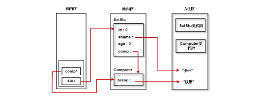

# Java的对象，引用和对象赋值

## 关于对象和引用

## 概述

```java
//一个简单类
class Vehicle{
    int passeragers;
    int fuelcap;
    int mpg;
}

//创建对象
Vehicle veh1 = new Vehicle();
/**
 *通常把这条语句称之为创建一个对象。其中这条语句包含了4个动作：
 * 1.new Vehicle ，这里没有带括号。 是以类Vehicle为模板在堆中开辟相应的内存，创建一个Vehicle对象
 * 2. 括号"()"表示在对象创建后，立即调用Vehicle类的构造函数，对刚生成的对象进行初始化操作，构造函数肯定会有的，如果没有写的话，会自动加入。
 * 3. Vehicle veh1 则是创建了一个Vehicle类的引用变量，就是以后可以用来指向一个Vehicle对象的对象引用
 * 4. 赋值操作符，使得对象引用变量指向刚创建的Vehicle对象
 */

//上述语句可以进行拆分：
// Vehicle veh1；
//veh1 = new Vehicle();
//这样写比较清楚，创建了两个实体变量，一个是对象引用变量veh1，一个是对象本身
```

## 一个典型类的内存三区分布图

```java
class Computer{
	String brand;
}
//未初始化的成员变量，整型初始化为0，String类型初始化为null
public class SxtStu{
    int id;
    String name;
    int age;
    Computer comp; //使用自定义类作为自身属性，数据可以是基本类型，也可以是引用类型
    //基本类型8个：byte, short, int, long, long long, boolean,float, double
    //除了基本类型和enum，其他所有类型为reference类型
    //构造函数
    SxtStu(){
    }
    void study(){
    	int a = 0;	//局部变量
        System.out.println("我正在学习！使用我们的电脑，"+comp.brand);
    }
    
    public static void main(String[] args){
        SxtStu stu1; 
        stu1 = new SxtStu(); 
        stu1.name = "张三";
        Computer comp1; 
        comp1 = new Computer();
        comp1.brand = "联想";
        stu1.comp = comp1;	//类的赋值
        stu1.study();
        
    }
    
}
//我正在学习！使用我们的电脑，联想
```



- 这个分区图也验证上述的叙述：
  - `SxtStu stu1` 和`Computer comp1`是一个对象引用变量，存放在栈区
  - `new SxtStu()`和 `new Computer()`是依据模板类创建的对象的实例，存放在堆中
  - 方法区中存放不变的量，常量，或者唯一的量

## 更深一步

- 既然语句`new SxtStu()`和 `new Computer()`是创建一个对象实例，那么这个对象实例的名字叫什么？
  - 有人叫`SxtStu`和 `Computer`，这种叫法是不对的，`SxtStu`和 `Computer`是模板类的名字，一个模板类可以创建出无数个对象实例，不能没一个对象都叫`SxtStu`和 `Computer`
  - 所以说新创建的对象实例连名称都没有，所以我们必须使用对象引用变量来进行间接访问
- 网上关于对象和对象引用有一个比喻：把对象看做一个巨大无比的气球，你无法直接用手控制这个巨型气球，但是我们可以再气球系上一根绳子（对象引用变量），所以我们可以通过绳子(对象引用变量)来间接控制气球(对象实例)
  - `SxtStu stu1;` 和` Computer comp1;`这两句话，只是有了绳子，但是没有气球，更没有把绳子的一端系在气球上
  - ` stu1 = new SxtStu(); `和`comp1 = new Computer();`则将上述两步完成了！
  - 如果有`SxtStu stu2 = stu1;` 和` Computer comp2 = comp1;`这就相当于发生了一个气球上系多根绳子的情况，这里要注意的是气球本身只有一个，只是对象引用变量多了
- **结论**：
  - 一个对象引用变量可以指向0个或者1个对象（一根绳子可以不系气球，也可以系一根气球）
  - 一个对象可以有N个引用来指向（一个气球可以系N根绳子）
- 如果没有绳子系在气球上，而我们也无法直接访问对象实例，那么这个未被对象引用变量指向的对象实例将会被Java的垃圾回收机制当做处理对象，至于什么时候被回收，就要看垃圾回收机制的心情了。
- 那么`  new SxtStu(); `和`new Computer();`就没有意义了吗？
  - 在某些情况下，是这样的
  - 但是这种写法是合法的，比如：我们仅仅为打印而生成一个对象，在打印完成后就被丢弃
  - `System.out.println("Hello Java!")`

##  上述问题的总结

> Java对象及引用是容易混淆却又必须掌握的基础知识，本章阐述Java对象和引用的概念，以及与其密切相关的参数传递。 

- Java对象和引用的关系可以说是互相关联，却又彼此独立。

  - 彼此独立主要表现在：引用是可以改变的，它可以指向别的对象,如：  

    ```java
     SxtStu stu1; 
     stu1 = new SxtStu(); 
     stu1 = new SxtStu(); 
     //这里有点不好区分，主要是因为构造函数无参数，但是你要注意，这真的是两个不同的对象实例
    ```

  - 从存储空间上来说，对象和引用也是独立的，它们存储在不同的地方:

    - 对象一般存储在堆中
    - 而引用存储在速度更快的堆栈中 

- 当修改对象引用变量指向的对象实例，其他的对象引用变量也发生了相应的修改

  - 就是因为对同一个对象的对象引用变量指向的空间是一样的

## 参数传递问题

- 一般面试题都会考Java的传参的问题，而且他的标准答案是Java只有一种参数传递方式：按值传递；Java中传递任何东西都是按值传递，如果传入方法的是基本类型的东西，你就得到此基本类型的一份拷贝。如果是传递引用，就得到引用的拷贝。 

- 一般来说：对于基本类型的传递，我们可以很容易的理解；但是对于对象的传递，总感觉像是按引用传递：

  ```java
  
  public class test1{
  
      public static void  testBasicType(int m){
          System.out.println("testBasicType is m=" + m);//50
          m = 100;
          System.out.println("testBasicType is m=" + m);//100
      }
      
      public static void add(StringBuffer s) {  
          s.append("_add");  
      }  
      public static void changeRef(StringBuffer s) {  
          s = new StringBuffer("Java");  
      }  
      public static void main(String[] args){
          int m = 50;  
          testBasicType(m);  
          System.out.println("main is m = " + m);//i=50  验证Java的按值传递
          StringBuffer sMain = new StringBuffer("init");  
          System.out.println("sMain=" + sMain.toString());//sMain=init 
          add(sMain);  
          System.out.println("sMain=" + sMain.toString());//sMain=init_add  
          changeRef(sMain);  
          System.out.println("sMain=" + sMain.toString());//sMain=init_add  
      }
  }
  /**
  testBasicType is m=50
  testBasicType is m=100
  main is m = 50
  sMain=init
  sMain=init_add
  sMain=init_add
  */
  ```

  - testBasicType方法的参数是基本类型，尽管参数m的值发生改变，但并不影响   
  - add方法的参数是一个对象，当把sMain传给参数s时，s得到的是sMain的拷贝，所以s和sMain指向同一个对象，因此，使用s操作影响的其实就是sMain指向的对象，故调用add方法后，sMain指向的对象的内容发生了改变。  
  - 在changeRef方法中，参数也是对象，当把sMain传给参数s时，s得到的是sMain的拷贝，但与add方法不同的是，在方法体内改变了s指向的对象（也就是s指向了别的对象,牵着气球的绳子换气球了），给s重新赋值后，s与sMain已经毫无关联，它和sMain指向了不同的对象，所以不管对s做什么操作，都不会影响sMain指向的对象，故调用changeRef方法前后sMain指向的对象内容并未发生改变。  
  - 对于add方法的调用结果，可能很多人会有这种感觉：这不明明是按引用传递吗？对于这种问题，还是套用Bruce Eckel的话：这依赖于你如何看待引用，最终你会明白，这个争论并没那么重要。真正重要的是，你要理解，传引用使得（调用者的）对象的修改变得不可预期。  

