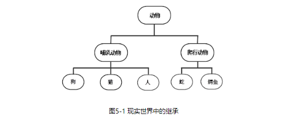
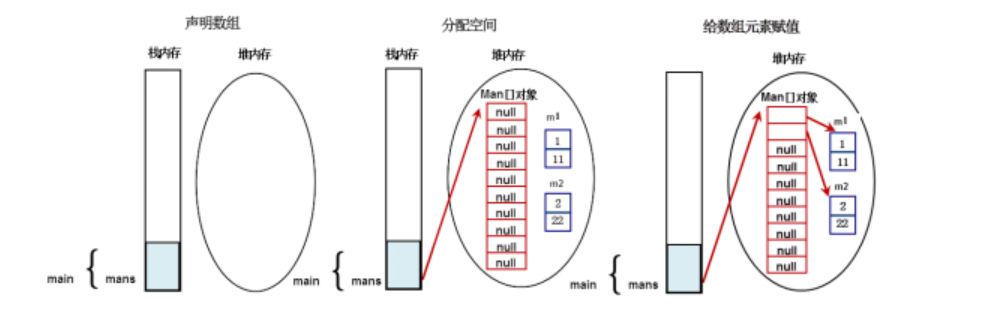

# 面对对象进阶

[TOC]


# 概述

- 本章主要是针对面向对象的三大特性：
  - 封装
  - 继承
  - 多态
- 还包括抽象类，接口和内部类的概念
- 学习建议：
  - 莫停留，从应用中来理解本章

# 继承(extends)的实现

- 继承让我们更加容易理解累的扩展

- 继承的例子:

  

- 人的继承案例：

  ```java
  //基类，超类
  class Person{
      String name;
      int age;
      int height;
      public void rest(){
          System.out.println("休息一会！");
      }
  }
  //派生类
  class Student extends Person{
      String major;
      //天然拥有父类属性
      public Student(String name, int age, int height,String major){
          this.name = name;
          this.age = age;
          this.height = height;
          this.major = major; 
      }
      public void study(){
          System.out.println("学习Java!");
      }
  }
  public class PersonExtends{
      public static void main(String[] args){
  
          Student Stu1 = new Student("wyk",24,175,"automation");
          Stu1.study();
          Stu1.rest();
          Stu1.study();
      }
  }
  /*
  学习Java!
  休息一会！
  学习Java!
  */
  ```

# instanceof 运算符

- `instanceof` 是2元运算符，左边是对象，右边是类；
- 当对象是右面类或者子类所创建的对象，返回`true` ,否则返回`false`

```java
/**
 * instanceof 的用法
 */
class Person{
    String name;
    int age;
    int height;
    public void rest(){
        System.out.println("休息一会！");
    }
}
//派生类
class Student extends Person{
    String major;
    public Student(String name, int age, int height,String major){

        this.name = name;
        this.age = age;
        this.height = height;
        this.major = major; 
    }
    public void study(){
        System.out.println("学习Java!");
    }
}
public class InstanceofPersonExtends{
    public static void main(String[] args){
        Student Stu1 = new Student("wyk",24,175,"automation");
        Stu1.study();
        Stu1.rest();
        Stu1.study();
        System.out.println( Stu1 instanceof Student );
        System.out.println( Stu1 instanceof Person );
    }
}

/**
学习Java!
休息一会！
学习Java!
true
true
*/
```

# 继承使用要点

- 父类也叫超类，基类
- Java中只有单继承，没有像C++一样的多继承
  - 多继承会引起混乱，使得继承过于复杂，系统难以维护
- Java中没有多继承，接口有多继承
- 子类继承父类，可以得到父类的全部属性和方法(除了父类的构造方法)
- 如果定义一个类时，没有调用`extends`,则它的父类时`java.lang.Object`

# 方法的重写(override)

- 子类通过重写父类的方法，可以使用自身的行为替换父类的行为
- 重写是实现多态的必要条件
- 方法的重写需要符合下面三个条件：
  - "==" :方法名，形参列表相同
  - “<=” : 返回值类型和声明异常类型，子类小于等于父类
  - “>=” : 访问权限，子类大于等于父类
    - 针对于第二点，返回值类型主要和继承联系在一块
    - 针对于第三点，有一个表格

# Object 类基本特征

- `Objec`t 类是所有Java类的根基类
- 意味着所有的Java对象都拥有`Object`类的属性和方法
- 如果在类的声明中未使用`extends`关键字指名其父类，则默认继承`Object`类
- 自定义类也是默认继承`Object`类

#  toString方法

- Object类中定义有`public String toString()`方法，其返回值类型为`String`

  ```java
  public String toString() {
      return getClass().getName() + "@" + Integer.toHexString(hashCode());
  }
  //根据源码得知：toString默认会返回"类名+@+16进制的hashcode"
  //此方法在打印输出或者用字符串连接对象时会自动调用
  ```

  ```java
  /**
   * 测试toString方法和重写toString方法
   */
  class Person{
      String name;
      int age;
  
      @Override
      public String toString(){
          return "姓名：" + name + "; 年龄：" + age;
      }
  }
   public class ToString{
       public static void main(String[] args){
  
          Person per1 = new Person();
          per1.age = 24;
          per1.name = "wyk";
          System.out.println("Info:" + per1);
  		//用字符串连接对象
          ToString str = new ToString();
          System.out.println(str);
  		//打印对象输出
       }
   }
   /*
   Info:姓名：wyk; 年龄：24
  ToString@139a55
   */
  //toString()方法在打印输出或者用字符串连接对象时会自动调用
  ```

# 关于`==` 和`equals()`方法

- 关于`==`：

  - 如果是比较基本类型时表示值相等，浮点数不用`==` 比较
  - 如果是比较引用类型时，表示引用对象的地址相等

- 关于`equals()`:

  - 对象的内容相等

    - 我们在公安系统中认为id相同的人就是同一个人
    - 学籍系统中认为学号相同的人就是同一个人

  - `Object类`的`equals（）`默认方法是比较两个对象的`hashcode`,是同一个对象的引用时返回 true 否则返回 false。 

    ```java
        public boolean equals(Object obj) {
            return (this == obj);
        }
    //Object类中的equals的源码，这里表明，`== `和equals()方法是一致的
    //经常对equals()方法重写
    ```

- 举例：

  ```java
  /**
   * 测试`==`和 equals()方法
   * 重写equals()方法
   */
  public class TestEquals{
      public static void main(String[] args){
          Object obj;
          Person p1 = new Person(100,"wyk1",22);
          Person p2 = new Person(100,"wyk2",22);
          System.out.println(p1 == p2);
          System.out.println(p1.equals(p2));
  
          String str1 = new String("111");
          String str2 = new String("111");
          System.out.println(str1 == str2);
          System.out.println(str1.equals(str2));
      } 
  }
  class Person{
      int id;
      String name;
      int age;
      Person(int id, String name, int age){
          super();
          this.id = id;
          this.name = name;
          this.age = age;
      }
      @Override
      public boolean equals(Object obj) { //强制转型
          Person other = (Person)obj;
          return this.id == other.id;
      }
  }
  
  /**
  只要id相等
  false
  true
  字符串也重写了equals方法，比较字符相等
  false
  true
  */
  ```

# super关键字

- `super`是直接父类的引用

  - 可以使用`super（）`关键字来访问父类中被子类覆盖的属性和方法

- 如果使用`super()`来调用普通的方法，语句位置没有限制，可以再子类中随便调用

- 如果是在构造方法的非注释第一行代码没有显示的调用`super（）`或者`this()`；那么Java默认会调用`super()`，含义是调用父类的无参数构造方法

- 例子

  ```java
  /**
   * 测试super()在普通方法的作用
   */
  public class TestSuper01 { 
      public static void main(String[] args) {
          new ChildClass().f();
      }
  }
  class FatherClass {
      public int value;
      public void f(){
          value = 100;
          System.out.println ("FatherClass.value="+value);
      }
  }
  class ChildClass extends FatherClass {
      public int value;
      public void f() {
          super.f();  //调用父类对象的普通方法
          value = 200;
          System.out.println("ChildClass.value="+value);
          System.out.println(value);
          System.out.println(super.value); //调用父类对象的成员变量
      }
  }
  
  /*
  FatherClass.value=100
  ChildClass.value=200
  200
  100
  */
  ```

# 继承树追溯

- 属性或者方法的查找顺序

  1. 先查找当前类中有没有属性h
  2. 依次上溯每个父类，查看每个父类中是否有h，直至Object
  3. 如果没找到，则出现编译错误；如果找到了，则过程终止

- 构造方法的调用顺序：

  - 由于构造方法的第一句总是`super()`，所以先向上追溯到Object，然后在依次向下执行类的初始化和构造方法，直至当前子类
  - 静态初始化块的调用顺序和构造方法一致

  ```java
  /**
   *继承树追溯
   **/
  public class TestSuper02 { 
      public static void main(String[] args) {
          System.out.println("开始创建一个ChildClass对象......");
          new ChildClass();
      }
  }
  class FatherClass {
      public FatherClass() {
          System.out.println("创建FatherClass");
      }
  }
  class ChildClass extends FatherClass {
      public ChildClass() {
          System.out.println("创建ChildClass");
      }
  }
  /*
  开始创建一个ChildClass对象......
  创建FatherClass
  创建ChildClass
  */
  ```

# 封装的作用和含义

- 封装的优点：
  -  提高代码的安全性
  - 提高代码的复用性
  - “高内聚”：封装细节，便于修改内部代码，提高可维护性
  - “低耦合”：简化外部调用，便于调用者使用，便于扩展和协作

## 封装的实现-- 访问控制符

- Java使用“访问控制符”来控制那些细节需要封装，那些细节需要暴露

- 权限表：

  作用域    当前类  同包 子类 其他

  `public`        √        √       √      √

  `protected`  √        √       √      ×

  `default `      √       √       ×      ×   表示没有修饰符

  `private`       √        ×      ×      ×

## 封装的使用细节

- 类属性处理：

  - 一般使用`private`访问权限
  - 应该提供`get/set`方法来访问相关属性，这些方法通常使用`public`修饰
  - 一些只用于本类的辅助性方法可以使用`private`修饰，希望其他类调用的方法用`public`修饰

- 例子：

  ```java
  /**
   * 封装的使用细节
   */
  public class TestPerson{
      public static void main(String[] args){
  
      }
  }
  
  class Person{
      private String name;
      private int age;
      private boolean flag;
  
      public String GetName(){
          return name;
      }
      public void SetName(String name){
          this.name = name;
      }
  
      public int GetAge(){
          return age;
      }
      public void SetAge(int age){
          this.age = age;
      }
  
      public boolean isFlag() {// 注意：boolean类型的属性get方法是is开头的
          return flag;
      }
      public void setFlag(boolean flag) {
          this.flag = flag;
      }
  }
  ```

# 多态

- 同一个方法的调用，由于对象不同可能会有不同的行为。

  - 比如：同一个人休息：
    - 有人睡觉
    - 有人打游戏

- 多态的要点：

  - 多态是方法的多态，而非属性的多态
  - 多态的必要条件：继承，方法重写，父类引用指向子类对象
  - 父类引用指向子类对象后，用该父类引用调用子类重写的方法，此时多态就出现了

- 例子

  ```java
  import javafx.scene.AmbientLight;
  
  /**
   * 测试多态的三个必要条件
   */
  
   //继承和方法重写
  class Animal {
      public void shout() {
          System.out.println("叫了一声！");
      }
  }
  class Dog extends Animal {
      public void shout() {
          System.out.println("旺旺旺！");
      }
      public void seeDoor() {
          System.out.println("看门中....");
      }
  }
  class Cat extends Animal {
      public void shout() {
          System.out.println("喵喵喵喵！");
      }
  }
  
  public class TestPolym{
      public static void main(String[] args){
          Animal an1 = new Animal();
          Animalshout(an1);
          //父类引用指向子类对象
          Animal an2 = new Dog(); //向上转型 
          Animalshout(an2); 
  
          Animal an3 = new Cat();//向上转型 
          Animalshout(an3);
  
      }
  
      static void Animalshout(Animal an){
          an.shout();
      }
  }
  
  /*
  叫了一声！
  旺旺旺！
  喵喵喵喵！
  */
  ```

# 对象的转型

- 向上转型
- 向下转型（进行强制类型转换）

```java
/**
 * 对象的转型操作
 */
class Animal {
    public void shout() {
        System.out.println("叫了一声！");
    }
}
class Dog extends Animal {
    public void shout() {
        System.out.println("旺旺旺！");
    }
    public void seeDoor() {
        System.out.println("看门中....");
    }
}
class Cat extends Animal {
    public void shout() {
        System.out.println("喵喵喵喵！");
    }
}

public class casting {
    public static void main(String[] args){
        Animal an1 = new Animal();
        Animalshout(an1);
        //父类引用指向子类对象
        Animal an2 = new Dog();//向上转型，自动类型转化
        Animalshout(an2);

        Dog an4 = (Dog)an2; //向下转型，需要强制类型转化
        an4.seeDoor();


        Animal an3 = new Cat();
        Animalshout(an3);
    }

    static void Animalshout(Animal an){
        an.shout();
    }
}
/*
叫了一声！
旺旺旺！
喵喵喵喵！
看门中....
*/
```

# `final` 关键字

- 修饰变量：被他修饰的变量是不可改变的，必须在变量定义时赋初值
- 修饰方法：该方法无法被子类重写，但是可以被重载
- 修饰类    ：修饰的类不能被继承

# 数组（复习）

- 数组也是对象
- 特点：
  - 长度确定
  - 元素相同类型
  - 数组可以为任何类型，包括基本类型和引用类型
- 数组变量属于引用类型，数组也可以看做对象，数组的每一个元素相当于该对象的成员
- 数组本身就是对象，数组是在堆中存储的

## 数组的声明和定义

```java
/**
 * 测试基本数据类型的数组的三种初始化方式
 */
public class TestArray{

    public static void main(String[] args){


        int[] array1;  //对象引用类型，声明的时候并没有实例化任何对象，在栈中
        array1 = new int[10]; //默认初始化为0
        for(int x : array1)
            System.out.print(x + "\t");
        System.out.print("\n");

        int array2[] = {1,2,3,4,54,};
        for(int x : array2)
            System.out.print(x + "\t");
        System.out.print("\n");
        int array3[];
        array3 = new int[10]; //默认初始化为0
        for(int x : array3)
            System.out.print(x + "\t");
        System.out.print("\n");
    }
}

/*
0      0       0       0       0       0       0       0       0       0
1       2       3       4       54
0      0       0       0       0       0       0       0       0       0
*/
```

```java
/**
 * 测试数组的引用类型
 */
class Man{
    private int age;
    private int id;
    public Man(int id,int age) {
        super();
        this.age = age;
        this.id = id;
    }
}
public class TestArray1{
    public static void main(String[] args){

        Man[] mans1; //声明引用类型数组
        mans1 = new Man[10];  //在堆上创建Man引用类型数组对象，共10个成员,默认为null

        Man mans2 = new Man(1,11); 
        Man mans3 = new Man(2,22);

        mans1[0] = mans2; //引用类型对象的成员0和mans2的引用类型 引用相同的对象
        //所以这样的话，操控mans1[0]，mans2也会发生相应改变
        mans1[1] = mans3;

    }
}
```

内存示意图：




# 数组的初始化

- 静态初始化：

  ```java
  int[] a = {1,2,3,4,5};
  Man[] mans1 = {new(1,11),new(2,22)};
  ```

- 动态初始化：

  - 使用`new`关键字

    ```java
    int[] a = new int[2];
    a[0] = 1;
    a[1] = 2;
    ```

- 数组的默认初始化

  ```java
  int a[] = new int[2];//默认为0
  boolean[] b = new boolean[2]; //默认为：false ,false
  String[] s = new String[2]; //默认值为false,false
  ```

# 数字的遍历

- `foreach`方法
- `for`循环方法

# 数组的拷贝

- `System类里也包含了一个数组拷贝方法：`
  - `static void arraycopy(object src，int srcpos，object dest， int destpos，int length)`
  - 作用：该方法可以将src数组里的元素值赋给dest数组的元素，其中srcpos指定从src数组的第几个元素开始赋值，length参数指定将src数组的多少个元素赋给dest数组的元素。 

```java
/**
 * 测试数组拷贝函数
 */

public class CopyArray{

    public static void main(String[] args){

        String[] str1 = {"111","222","333","444","555"};
        String[] str2 = new String[6];
        System.arraycopy(str1, 0, str2, 0, str1.length);

        for(String str : str2)
            System.out.println(str);
    }
}
/*
111
222
333
444
555
null
字符串数组默认初始化为null
*/
```

# `java.util.Arrays` 类

```java
import java.util.Arrays;
/**
 * Test java.util.Arrays class
 */
public class TestArrayclass{
    public static void main(String[] args){

        int[] a = {1,3,5,7,9,2,4,6,8,0};
        System.out.println(a);
        System.out.println(a.toString());
        System.out.println(Arrays.toString(a));
        //此时的Array.toString()方法是Arrays的静态方法
        //输出a,相当于调用a.toString()方法，属于Object类的方法
        //不是说静态方法不能必须调用静态方法吗?这里好像不符合？？

        Arrays.sort(a);//排序算法
        System.out.println(Arrays.toString(a));
        System.out.println(Arrays.binarySearch(a, 3)); //二分查找，先排序
        Arrays.fill(a, 2,4,100); //数组填充
        System.out.println(Arrays.toString(a));
    }
}
/*
[I@139a55
[I@139a55
[1, 3, 5, 7, 9, 2, 4, 6, 8, 0]
[0, 1, 2, 3, 4, 5, 6, 7, 8, 9]
3
[0, 1, 100, 100, 4, 5, 6, 7, 8, 9]
*/
```

# 多维数组

```java
import java.util.*;
public class TestArrays{
    public static void main(String[] args){
        //两种初始化方式
            //一种指定行数和列数
            //一种只指定行数，不指定列数
        int[][] a = new int[2][2];
        int[][] b = new int[2][]; //可指名行，不指名列
        b[0] = new int[1];
        b[1] = new int[3];
        //二维数组的静态初始化
        int[][] c = {{1,2},{3,4}};
        //二维数组的动态初始化
        int[][] d = new int[3][];
        d[0] = new int[]{1,2};
        d[1] = new int[]{3,4};
        d[2] = new int[]{5,6};
        System.out.println(Arrays.toString(d[0]));
        System.out.println(Arrays.toString(d[1]));
        System.out.println(Arrays.toString(d[2]));

    }
}
/*
[1, 2]
[3, 4]
[5, 6]
*/
```

# 数组存储表格数据（就是存储不同数据）

- 使用`Object` 来声明

  ```java
  /**
   * 数组存储表格数据
   */
  import java.util.Arrays;
  
  public class test2{
  
      public static void main(String[] args){
          Object[] a1 = {100,"w",20,"讲师","2016-01-01"};
          Object[] a2 = {102,"y",21,"副教授","2016-01-02"};
          Object[] a3 = {103,"k",22,"教授","2016-01-03"};
  
          Object[][] emper = new Object[3][];
          emper[0] = a1;
          emper[1] = a2;
          emper[2] = a3;
  
          System.out.println(Arrays.toString(emper[0]));
          System.out.println(Arrays.toString(emper[1]));
          System.out.println(Arrays.toString(emper[2]));
      }
  }
  /*
  [100, w, 20, 讲师, 2016-01-01]
  [102, y, 21, 副教授, 2016-01-02]
  [103, k, 22, 教授, 2016-01-03]
  */
  ```

# 冒泡排序

```java
public class Bubble{

    public static void main(String[] args){

        int[] a = {1,3,5,7,9,2,4,6,8,0};
        System.out.println("********冒牌排序开始**********");
        System.out.println("排序前元素：");
        for(int x:a)
            System.out.print(x);
        OptimizeBubbleSort(a);
        System.out.println("\n排序后元素:");
        for(int x:a)
            System.out.print(x);
        System.out.println("\n********冒牌排序结束**********");

    }

    private static void BubbleSort(int[] a){
        // 外层循环：n个元素排序，则至多需要n-1趟循环
        for(int i = 1; i < a.length; i ++){
            for(int j = 0; j < a.length - i; j ++){
                if(a[j] > a[j+1]){
                    int temp = a[j];
                    a[j] = a[j+1];
                    a[j+1] = temp;
                }
            }
        }
    }

    private static void OptimizeBubbleSort(int[] a){
        // 外层循环：n个元素排序，则至多需要n-1趟循环
        for(int i = 1; i < a.length; i ++){
            boolean flag = true;
            for(int j = 0; j < a.length - i; j ++){
                if(a[j] > a[j+1]){
                    int temp = a[j];
                    a[j] = a[j+1];
                    a[j+1] = temp;
                    flag = false;
                }
            }
            if(flag)
                break;

        }
    }
    //增加标志位的作用是减少外层循环数

}
```


