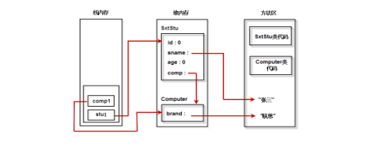

# Java 面向对象基础

## 1. 面向过程和面向对象

- 1.1 面向过程
  - 面向过程思考问题，主要是思考这个过程的流程实现
  - 比如开车来说：需要1.发动车 2. 挂挡 3. 踩油门 4. 跑路
  - 面向对象主要是适合简单，不需要过多协作的事物
- 1.2 面向对象
  - 面向对象主要是考虑比较复杂的问题
  - 比如说如何造车？直接按照面向对象那样列一个步骤是不可能的
  - 造车这件事的复杂度太高，需要很多协作
  - 针对于造车这件事来说，我们先思考车是怎么设计的，这就是思维的转变，也是两种语言最大的不同
  - 面对造车这件事，从属性和方法入手来进行：
    - 车的对象组成：
      - 轮胎 发动机 车壳 座椅 挡风玻璃 ... 
    - 为了便于协作，我们早轮胎厂制作轮胎，找发动机厂制作发动机。。。
  - 因此面对对象从宏观上把控，从整体上分析，具体的方法实现，仍然需要面向过程的思想
- 总结
  - 都是解决问题的思维方式，都是代码组织的方式
  - 解决简单问题可以使用面向过程的思维方式
  - 解决复杂程度高，多协作问题可以使用面向对象的思维方式
- 两种方式的特征
  - 面向过程：封装
  - 面向对象：封装，继承，多态

# 关于对象

- 对象也是一种数据结构（对数据的管理模式），将数据和数据的行为存放在了一起
- 在内存上，对象是一个内存块，存放了相关的数据集合
- 对象的本质是一种数据的组织方式

# 关于类

- 类是对对象的抽象，就是将一类对象的基本的属性和方法抽象出来，构造成了类`class`，而对象`Objector instance`是类的一个实例
- 对象是具体的事物，类是对一类事物的抽象
- 类可以看作是一类对象的模板

# 第一个类

```java
public class xxx{
}
class xx{}
class x{}
//每一个源文件必须有且只有一个public class，并且类名和文件名保持一致
```

```java
public class Stu{
//成员变量
    int id;
    String name;
    int age;
    //构造方法
    Stu(){
    }
    void study(){
    	int a = 0;	//局部变量
        System.out.println("我正在学习");
    }
}
```

# 属性

- 属性用于定义该类或者该类的对象所包含的数据或者静态特征
- 属性在定义时可以对其初始化，如果不对齐初始化，Java使用默认值来进行初始化
  - 布尔型为`false`
  - 所有的引用类型：`null`

# 方法

- 方法用于定义该类或者该类实例的行为特征或者功能实现
- 其方法的实现格式和面向过程一致

# 一个典型类

```java
class Computer{
	String brand;
}
//未初始化的成员变量，整型初始化为0，String类型初始化为null
public class SxtStu{
    int id;
    String name;
    int age;
    Computer comp; //使用自定义类作为自身属性，数据可以是基本类型，也可以是引用类型
    //基本类型8个：byte, short, int, long, long long, boolean,float, double
    //除了基本类型和enum，其他所有类型为reference类型
    SxtStu(){
    }
    void study(){
    	int a = 0;	//局部变量
        System.out.println("我正在学习！使用我们的电脑，"+comp.brand);
    }
    
    public static void main(String[] args){
        SxtStu stu1 = new SxtStu(); 
        stu1.name = "张三";
        Computer comp1 = new Computer();
        comp1.brand = "联想";
        stu1.comp = comp1;	//类的赋值
        stu1.study();
        
    }
    
}
//我正在学习！使用我们的电脑，联想
```

# 面向对象的内存分析

- JVM的内存分为三个区：栈`stack`，堆`heap` ，方法区`method area`

## 栈

- 每一个方法调用时都会创建一个栈区(存放局部变量，操作数，方法出口等)

- 栈是一个连续的空间，速度快
- 栈属于线程私有，无法实现线程间共享

- 先进后出

## 堆

堆用于存储创建好的对象和数组

JVM只有一个堆，可以被所有线程共享

堆的空间地址不连续，分配灵活，速度慢

## 方法区

JVM只有一个方法区，被所有线程共享

方法区实际上也是堆，只是用于存储类，常量等相关信息

用来存放程序中永远不变或者唯一的内容（类信息，静态变量，字符串常量等）



# 构造方法

- 构造方法用于对象的初始化
- 构造方法在创建对象时被自动调用的特殊方法，目的是对象的初始化，构造器的名称应该与类的名称一致
- Java使用`new`关键字来调用构造函数，从而返回该类的一个实例

```java
[修饰符] 类名(形参列表){}
```

- 要点
  - 通过new来自动调用
  - 构造器有返回值，但是不能定义返回类型（返回值类型为本类），不能在构造器中使用`return`返回某个值
  - 若未定义构造器，则编译器会自动定义一个无参数的构造函数
  - 构造器的方法名和类名一致
- 例子：定义一个“点”(Point)类用来表示二维空间中的点(有两个坐标)。要求如下： 
  - 可以生成具有特定坐标的点对象。 
  - 提供可以设置坐标的方法。 
  - 提供可以计算该“点”距另外一点距离的方法。 

```java
/**
 * 例子：定义一个“点”(Point)类用来表示二维空间中的点(有两个坐标)。要求如下： 
 * 可以生成具有特定坐标的点对象。 
 * 提供可以设置坐标的方法。 
 * 提供可以计算该“点”距另外一点距离的方法。 
 */

 public class point{

    int Point_x;
    int Point_y;
    point(int x,int y){
        Point_x = x;
        Point_y = y;
        System.out.println("x = " + Point_x + " y = " + Point_y);
    }

    public boolean SetPoint(int x, int y){
        Point_x = x;
        Point_y = y;
        System.out.println("x = " + Point_x + " y = " + Point_y);
        return true;
    }

    public double Distance(int Start_x, int Start_y, int End_x, int End_y){

        int Distance_x = End_x - Start_x;
        int Distance_y = End_y - Start_y;

        return Math.sqrt(Distance_x * Distance_x + Distance_y * Distance_x);
    }

    public static void main(String[] args){

        point pt = new point(10,10);
        pt.SetPoint(100, 200);
        System.out.println("(100,200)点距离(0,0)点的距离为" + pt.Distance(0, 0, 100, 200));
    }
 }
```

# 构造方法的重载

- 构造方法也是方法，不过是特殊的方法

```java
public class user {
    int id; // id
    String name; // 账户名
    String pwd; // 密码
    public user() {
        System.out.print("使用无参数构造函数\n");
    }
    public user(int id, String name) {
        super();    //构造方法的第一句总是super()
        this.id = id; //this 表示构造好的对象
        this.name = name;
        System.out.print("使用2参数构造函数\n");
    }
    //如果方法构造中形参名与属性名相同时，需要使用this关键字区分属性与形参。
    //this.id 表示属性id;id表示形参id
    public user(int id, String name, String pwd) {
        this.id = id;
        this.name = name;
        this.pwd = pwd;
        System.out.print("使用3参数构造函数\n");
    }
    public static void main(String[] args) {
        user u1 = new user();
        user u2 = new user(101, "wyk");
        user u3 = new user(100, "wyk", "000000");     
    }
}
/**
使用无参数构造函数
使用2参数构造函数
使用3参数构造函数
*/
```

# 垃圾回收原理

> Java只需要关注逻辑问题，而无需过多关注内存管理问题

- C++和 Java的比较

  

## 内存管理

- Java的内存管理很大程度上指的是对**对象**的管理，包括对象空间的分配和释放
- 使用`new`来分配对象的内存空间
- 将对象的值赋为`null`，即可释放对象空间，垃圾回收负责回收所有不可达对象的内存空间

## 垃圾回收过程

- 两个过程：

  1. 发现问题（无用对象）,这是一个问题！
  2. 解决问题（回收无用对象占用的内存空间）

- 垃圾回收的相关算法：

  - 引用计数法

    - `new`的对象的内存在堆中，堆和方法区可以被共享
    - 内一个对象都有一个引用计数，被引用一次计数+1，将对象赋值为`null`则计数减一，直至计数为0，就变成了无用对象
    - 优点是：算法简单
    - 缺点是：循环引用的无用的对象无法识别

  - 引用可达根(根搜索算法)

    

  - 程序把所有的引用看做一张图，从一个节点（GC ROOT）开始，寻找相对应的引用节点，找到这个节点之后，继续寻找这个节点的引用节点，当所有的引用节点找完以后，剩余未达的节点则被认为是没有被引用的节点，即无用的节点

## 通用的分代垃圾回收机制（把对象比做人，判断死亡概率）

- 分代垃圾回收处理机制，是基于这样一个事实：
  - 不同对象的声明周期不一样
  - 针对于不同生命周期的对象可以采取不同的回收算法
  - 对象分为三种状态：
    - 年轻代 ：存放在`Eden`和`Survivor`
    - 年老代 : 存放在`Tenured、Old`
    - 持久代 ：存放在`method area`
- 年轻代：
  - 所有新生成的对象首先都是放在`Eden`区。 
  - 年轻代的目标就是尽可能快速的收集掉那些生命周期短的对象，对应的是Minor GC，每次 Minor GC 会清理年轻代的内存，算法采用效率较高的复制算法，频繁的操作，但是会浪费内存空间。
  - 当“年轻代”区域存放满对象后，就将对象存放到年老代区域。 
- 年老代
  - 在年轻代中经历了N(默认15)次垃圾回收后仍然存活的对象，就会被放到年老代中。因此，可以认为年老代中存放的都是一些生命周期较长的对象。年老代对象越来越多，我们就需要启动Major GC和Full GC(全量回收)，来一次大扫除，全面清理年轻代区域和年老代区域。 
- 持久代
  - 用于存放静态文件，如Java类、方法等。持久代对垃圾回收没有显著影响。 

### 清理器

- Minor GC:
  - 用于清理年轻代区域。Eden区满了就会触发一次Minor GC。清理无用对象，将有用对象复制到“Survivor1”、“Survivor2”区中(这两个区，大小空间也相同，同一时刻Survivor1和Survivor2只有一个在用，一个为空)
- Major GC：
  - 用于清理老年代区域。
- Full GC：
  - 用于清理年轻代、年老代区域。 成本较高，会对系统性能产生影响。

### 垃圾回收过程

- 新创建的对象，绝大多数都会存储在Eden中.
- 当Eden满了（达到一定比例）不能创建新对象，则触发垃圾回收（GC），将无用对象清理掉，然后剩余对象复制到某个Survivor中，如S1，同时清空Eden区
- 当Eden区再次满了，会将S1中的不能清空的对象存到另外一个Survivor中，如S2，同时将Eden区中的不能清空的对象，也复制到S1中，保证Eden和S1，均被清空。
- 重复多次(默认15次)Survivor中没有被清理的对象，则会复制到老年代Old(Tenured)区中，
- 当Old区满了，则会触发一个一次完整地垃圾回收（FullGC），之前新生代的垃圾回收称为（minorGC）


# this关键字

- this 的本质就是创建好的对象的地址，在执行构造函数之前，对象就已经创建好了，在构造函数中可以使用`this`用来指代当前对象

- 创建对象的4步骤：

  - 分配对象空间，并且将对象成员初始化为0或者孔
  - 执行属性值的显式初始化
  - 执行构造方法（此时对象已经创建好），进一步初始化对象
  - 返回对象的地址给相关变量

- this的最常用的三个用法：

  -  在程序中产生二义性之处，应使用this来指明当前对象;普通方法中，this总是指向调用该方法的对象。构造方法中，this总是指向正要初始化的对象。 
  - 使用this关键字调用重载的构造方法，避免相同的初始化代码。但只能在构造方法中用，并且必须位于构造方法的第一句。 
  -  this不能用于static方法中。 ????有疑问！！！

  ```java
  public class TestThis {
      int a, b, c;
   //构造函数
      TestThis() {
          System.out.println("正要初始化一个Hello对象");
      }
      //构造函数重载
      TestThis(int a, int b) {
          // TestThis(); //这样是无法调用构造方法的！
          this(); // 调用无参的构造方法，并且必须位于第一行！
          //a = a;// 这里都是指的局部变量而不是成员变量
  // 这样就区分了成员变量和局部变量. 这种情况占了this使用情况大多数！
          this.a = a;
          this.b = b;
      }
      TestThis(int a, int b, int c) {
          this(a, b); // 调用带参的构造方法，并且必须位于第一行！
          this.c = c;
      }
   
      void sing() {
      }
      void eat() {
          this.sing(); // 调用本类中的sing();
          System.out.println("你妈妈喊你回家吃饭！");
      }
   
      public static void main(String[] args) {
          TestThis hi = new TestThis(2, 3);
          hi.eat();
      }
  }
  ```

# static关键字

> 一定要结合内存三区进行理解

- 在类中，用static声明的成员静态变量，也称之为类变量，类变量的生命周期和类相同，在整个应用程序执行期间都有效：

  - 为该类的公用变量，属于类，被该类的所有实例共享，在类被载入时被显式初始化。 
  - 对于该类的所有对象来说，static成员变量只有一份。被该类的所有对象共享!! 
  -  一般用“类名.类属性/方法”来调用。(也可以通过对象引用或类名(不需要实例化)访问静态成员。) 
  - 在static方法中不可直接访问非static的成员。 、

  ```java
  
  public class User2 {
      int id; // id
      String name; // 账户名
      String pwd; // 密码
       
      static String company = "wyk"; // 类变量
       
       
      public User2(int id, String name) {
          this.id = id;
          this.name = name;
      }
       
      public void login() {
          printCompany();
          System.out.println(company); 
          System.out.println("登录：" + name);
      }
       
      public static void printCompany() {
  //         login();//调用非静态成员，编译就会报错
          System.out.println(company);
      }
       
      public static void main(String[] args) {
          User2 u = new User2(101, "wyk");
          User2.printCompany();
          User2.company = "111";
          User2.printCompany();
      }
  }
  ```

  

## 总结

- `static`修饰的成员变量和方法从属于类（对于所有的对象来说，`static xx`只有一份）
- 普通变量和方法从属于对象
- `this`不能在静态方法中使用的原因：
  - `this`表示当前的对象，属于一个对象实例
  - `static` 成员变量和方法从属于类，对于所有的对象共享，若是在static里面使用`this`，表示的是哪个对象？？
- 静态方法不能调用非静态方法（相当于有了图纸，不一定有相应的对象）
- 非静态方法可以调用静态方法（相当于有了对象，一定能找见图纸的对应部分）

# 静态初始化块

- 构造方法用于对象的初始化

- 静态初始化块用于类的初始化

  - 静态初始化块不能初始化非静态变量和方法
  - 因为静态初始化块时还未创建对象

  ```java
  /**
   * 静态初始化块
   */
  public class User3 {
      int id;        //id
      String name;   //账户名
      String pwd;   //密码
      static String company; //公司名称
      static {
          System.out.println("执行类的初始化工作");
          company = "北京";
          printCompany();
      }  
      public static void printCompany(){
          System.out.println(company);
      }  
      public static void main(String[] args) {
          //进行类的初始化工作
          User3  u3 = null;
          //new User3 创建对象
          //()调用构造函数
      }
  }
  /*
  执行类的初始化工作
  北京
  */
  ```

#  参数传递

- Java中的参数传递方法只有一种，那就是值传递，也就是传递的**值的副本**
  - 换句话说，就是传递的原件的复印件，而非原件，因此复印件的改变并不会影响原件
- 基本数据类型的按值传递很好理解
- 引用类型的按值传递：
  - 在说明一次，传递的是值的副本。
  - 引用类型指的是对象的地址。
  - 引用类型按值传递指的是创建一个副本，这个副本指向的地址和原件一致
  - 这有个问题和基本类型不同：
    - 修改副本指向的对象的值，其相应的原件也受到相应的影响
    - 这里的引用类型的按值传递可以理解为一个气球上系了两根绳子，任何一根绳子对球球做出了位置移动，相应的另一根绳子也会改变
    - 但是修改副本指向的对象，则对原件无影响！！

```java
public class test1{

    public static void  testBasicType(int m){
        System.out.println("testBasicType is m=" + m);//50
        m = 100;
        System.out.println("testBasicType is m=" + m);//100
    }
    
    public static void add(StringBuffer s) {  
        s.append("_add");  
    }  
    public static void changeRef(StringBuffer s) {  
        s = new StringBuffer("Java");  
    }  
    public static void main(String[] args){
        int m = 50;  
        testBasicType(m);  
        System.out.println("main is m = " + m);//i=50  验证Java的按值传递
        StringBuffer sMain = new StringBuffer("init");  
        System.out.println("sMain=" + sMain.toString());//sMain=init 
        add(sMain);  
        System.out.println("sMain=" + sMain.toString());//sMain=init_add  
        changeRef(sMain);  
        System.out.println("sMain=" + sMain.toString());//sMain=init_add  
    }
}
/**
testBasicType is m=50
testBasicType is m=100
main is m = 50
sMain=init
sMain=init_add
sMain=init_add
*/
```

# 包

- 包机制是Java中管理类的重要手段。
  -  开发中，我们会遇到大量同名的类，通过包我们很容易对解决类重名的问题，也可以实现对类的有效管理。 
  - 包对于类，相当于文件夹对于文件的作用。 
- 可以类比于C++的命名空间

# package

